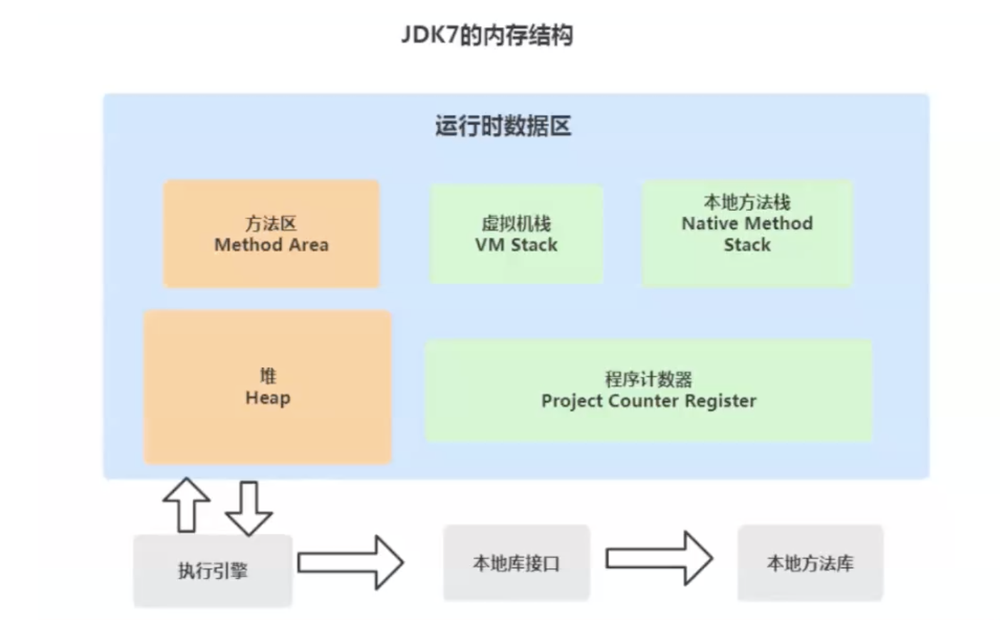
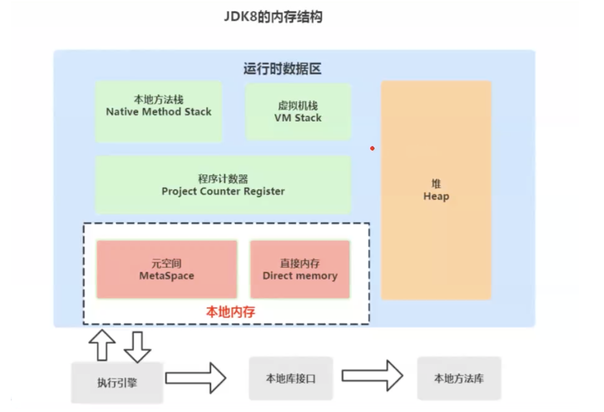

# java-technology-system
Summary of java technology stack

# JVM

## Java虚拟机内存管理

### 基本问题

1. Java为什么要多一层JVM，而不是直接编译成机器语言？

​	可以进行自动内存管理；针对不同系统定制化JVM，实现跨平台。

2. jdk7内存结构

3. jdk8的内存结构

4. JDK、JRE和JVM之间的关系

    - JDK（Java Development Kit）：是java的核心，运行java必须要有的东西，里面包括java运行环境JRE、java工具和java基础类库（java开发者使用的功能型类库）；
    - JRE（Java Runtime Environment）：运行java所必须的环境，里面包括JVM的实现和java核心类库（JVM工作所需的类库）；
    - JVM（Java Virtual Machine）：JVM 是java跨平台的核心，通过JVM屏蔽底层系统的差异，实现一次编译，处处运行。

5. Java程序执行流程

    - Java文件进行编译得到字节码文件；

    - JVM的类加载器加载字节码文件到JVM；

    - JVM内对应的执行引擎执行加载到的的字节码文件，并将其解析成对应的二进制可执行文件；

    - 执行二进制文件调用操作系统的接口；

6. 如何查看编译后的字节码文件

    - javap -v className

    - 插件：jclasslib Bytecode viewer

7. JVM架构

    - JVM整体架构分为五大模块：类装载器子系统，运行时数据区域，执行引擎，本地方法接口和垃圾收集；

       - JVM内存：JDK 7的方法区放到了JDK 8中的元空间中，元空间属于本地内存，本地内存不属于运行时内存。

