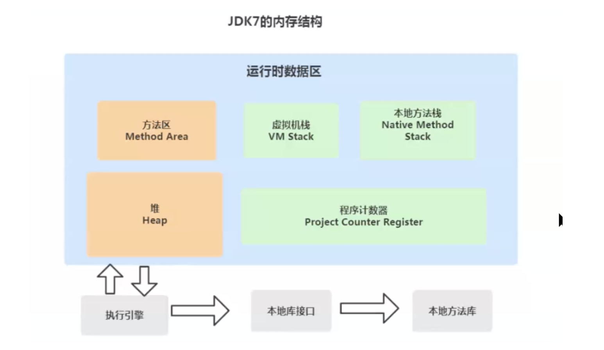
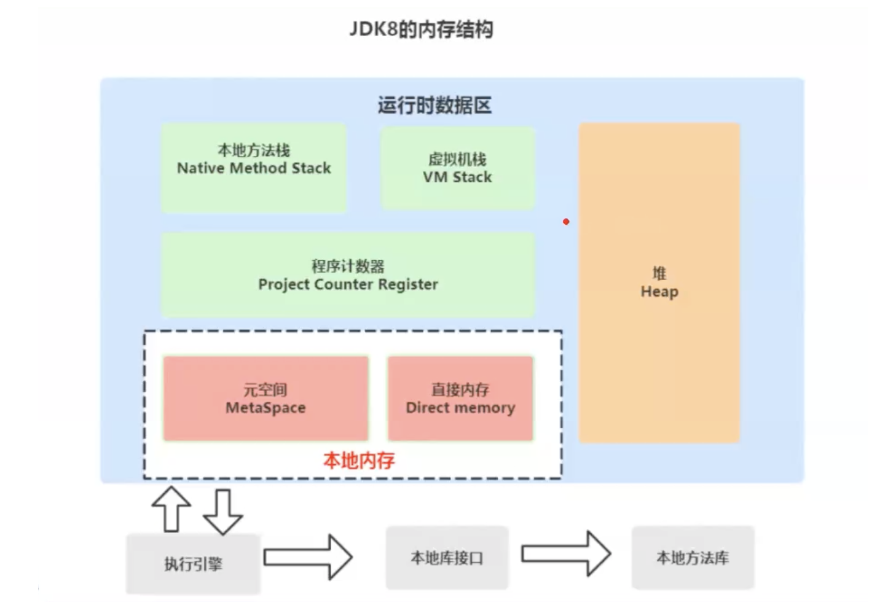
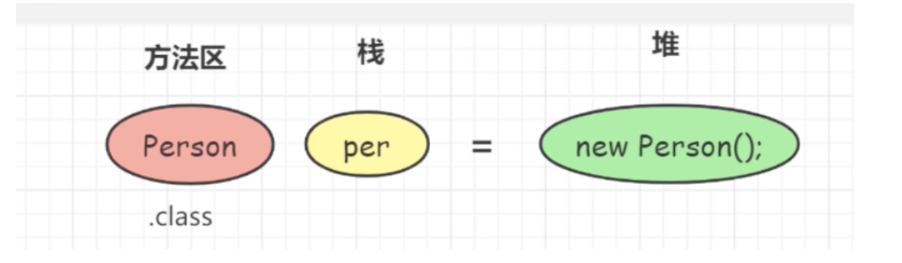

# java-technology-system
Summary of java technology stack


# JVM

## Java虚拟机内存管理

### 基本问题

1. Java为什么要多一层JVM，而不是直接编译成机器语言？

​	可以进行自动内存管理；针对不同系统定制化JVM，实现跨平台。

2. jdk7内存结构



3. jdk8的内存结构



4. JDK、JRE和JVM之间的关系

    - JDK（Java Development Kit）：是java的核心，运行java必须要有的东西，里面包括java运行环境JRE、java工具和java基础类库（java开发者使用的功能型类库）；
    - JRE（Java Runtime Environment）：运行java所必须的环境，里面包括JVM的实现和java核心类库（JVM工作所需的类库）；
    - JVM（Java Virtual Machine）：JVM 是java跨平台的核心，通过JVM屏蔽底层系统的差异，实现一次编译，处处运行。

5. Java程序执行流程

    - Java文件进行编译得到字节码文件；

    - JVM的类加载器加载字节码文件到JVM；

    - JVM内对应的执行引擎执行加载到的的字节码文件，并将其解析成对应的二进制可执行文件；

    - 执行二进制文件调用操作系统的接口；

6. 如何查看编译后的字节码文件

    - javap -v className

    - 插件：jclasslib Bytecode viewer

7. JVM架构

    - JVM整体架构分为五大模块：类装载器子系统，运行时数据区域，执行引擎，本地方法接口和垃圾收集；


       - JVM内存：JDK 7的方法区放到了JDK 8中的元空间中，元空间属于本地内存，本地内存不属于运行时内存。

### GC的分类

1. GC收集器分为两种：一种是部分收集器（Partial GC），另一类是整堆收集器（Full GC）。

    - 部分收集器(Partial GC)
        - 新生代收集 ( Minor GC / Young GC ) : 只是新生代的垃圾收集;
        - 老年代收集 ( Major GC / Old GC ): 只是老年代的垃圾收集 (CMS GC 单独回收老年代);
        - 混合收集 ( Mix GC ): 收集整个新生代和老年代的垃圾 ( G1会混合收集, region区域回收);

    - 整堆收集器(Full GC)
        -  收集整个java堆和方法区的收集器。

2. 各种GC的触发条件：

    - 年轻代GC (Minor GC)触发条件：

        - 年轻代空间不足，就会出发Minor GC。这里的年轻代单指Eden区，Suvivor区满不会触发垃圾收集；
        - Minor GC会引发STW (stop the world)。暂停其他用户的线程，等垃圾回收线程结束后，其他用户线程才恢复；

        - 老年代GC (Major GC)触发条件：
            - 老年代空间不足会尝试出发Minor GC，如果空间还是不足则触发Major GC；
            - 如果Major GC 空间仍然不足，则触发OOM；
            - Major GC的速度比Minor GC慢10倍以上；

        - 整堆收集 (Full GC)触发条件：
            - 调用System.gc系统会执行Full GC，但不是立即执行；
            - 老年代空间不足；
            - 方法区空间不足；

    注意：调优过程要尽量减少Full GC的次数。

### 元空间

1. Jdk 1.8的元空间和jdk 1.7的永久代的区别
    - 存储位置不同：永久代在物理上是运行时数据区的一部分，和堆的地址是连续的；而元空间属于本地内存；
    - 存储内容不同：1.7中永久代用于储存类的元数据信息、静态变量及运行时常量池等；在1.8中类的元数据信息存储在元空间中，静态变量和运行时常量池并在了堆中。相当于永久代被元空间和堆给瓜分了。
    -    - 
2. Java8的HotSpots取消了永久代，是不是就没有方法区的功能了？

    - 不是的，方法区只是一个规范，它的功能并没有取消，而是放在了元空间；

    - 方法区的内存在JDK 7中是和堆连在一起的，但是在JDK 8中不再与堆连续，而是放在了本地内存。
3. 方法区JDK 8的变化

    - 移除了永久代(PermGen)，替换为了元空间(Metaspace)；

    - 永久代中的类元信息(class metadata)转移到了本地内存(native meory)，而不是虚拟机；

    - 永久代中的字符串常量池(interned Strings)和类静态变量(class static variables)转移到了Java heap；

    - 永久代参数(PermSize MaxPermSize) --> 元空间参数(MetaspaceSize MaxMetaspaceSize) ;
4. Jdk 8为什么要将永久代替换为Metaspace

    - 常量池存在永久代中，容易出现性能问题和内存溢出。在永久代分离出来与类的元数据分开，提升类的元数据信息的独立性的同时提升GC效率；

    - 类及方法的信息比较难确定其大小，因此对于永久代的大小指定比较困难。太小容易出现永久代溢出，太大则容易导致老年代溢出。元数据信息分配在本地内存中，元空间最大分配空间就是系统的可用内存空间。不会遇到永久代存在时的内存溢出问题；

    - 永久代会为GC带来不必要的复杂度，并且回收效率偏低；

    - Oracle将HotSpot与JRockit合二为一，jRockit没有所谓的永久代；

### 方法区



1. 方法区存储的内容：类型信息(类信息、域信息、方法信息)、运行时常量池(运行时常量池、JIT代码缓存)。

    - 类型信息：

        每个加载的类型(类 Class、接口 Interface、枚举 enum、注解 annotation)，JVM必须在方法区中存储以下类型信息：

        - 这个类型的完整有效名称（类的全限定名）；
        - 这个类型直接父类的完整有效名（对于interface或是java.lang.Object都没有父类）；
        - 这个类型的修饰符（public，abstract，final 的某个子集）；
        - 这个类型直接接口的一个有序列表；

    - 域信息

        域信息即为类的属性、成员变量：

        - JVM必须在方法区中保存类所有的成员变量相关信息及声明顺序；
        - 域的相关信息包括：域名称、域类型、域修饰符（public、private、protected、static、final、volatile、transient的某个子集）；

    - 方法信息

        JVM必须保存所有方法的以下信息，同域信息一样包括声明顺序：

        - 方法名称、方法的返回类型（或void）；
        - 方法参数的数量和类型（按顺序）；
        - 方法的修饰符（public、private、protected、static、final、volatile、transient的某个子集）；
        - 方法的字节码bytecodes、操作数栈、局部变量表及大小（abstract和native方法除外）；
        - 异常表（abstract和native方法除外）。每个异常处理的开始位置、结束位置、代码处理在程序计数器中的偏移地址、被捕获的异常类的常量池索引。

### 常量池

1. 常量池和运行时常量池的区别

    - 所在位置不同；字节码文件中包含了常量池，方法区中包含了运行时常量池；

    - 作用不同；常量池存放编译期间生成的各种字面量与符号引用；

        ​		编译后的字节码文件中包含了类型信息、域信息和方法信息等，通过ClassLoader将字节码文件中常量池的信息加载到内存中，存储在了方法区中的运行时常量池中。

        ​		可以理解为字节码中的常量池Constant Pool 只是文件信息，他想要执行就必须加载到内存中。而java程序是靠JVM的执行引擎来解释执行的。执行引擎在运行时常量池中取数据，被加载的字节码常量池中的信息是放到了方法区中的运行时常量池。

2. 为什么需要常量池？

    代码中引用多个数据结构，常量池可以将这些引用转变为符号引用，等到用到时再加载。提高性能。

### 直接内存

1. 为什么需要直接内存？

    - 改善堆过大时垃圾回收效率，减少停顿。Full GC时会扫描堆内存，回收效率和堆大小成正比。native的内存由OS负责管理和回收，与JVM垃圾回收无关；
    - 减少内存在native堆和JVM堆中的拷贝过程，避免拷贝损耗，降低内存使用；
    - 可以突破JVM内存大小限制。直接内存不属于JVM，属于本地内存。

2. 直接内存大小

    直接内存的默认值和java堆的最大值一致；

### OOM

1. OOM常见原因
    - 内存中加载的数据过多，如一次从数据库中取出过多的数据；
    - 集合对象使用过多且使用后没有清空；
    - 代码中存在死循环或循环产生过多重复对象；
    - 堆内存分配不合理；

## JVM加载机制详解

### 类加载子系统

### 类生命周期的7个阶段

加载 ==》 验证 ==〉 准备 ==》 解析 ==〉 初始化 ==》 使用 ==〉 卸载

### 加载

有两种时机会触发类加载

- 预加载

    ​		虚拟机启动时加载，加载的是JAVA_HOME/lib/下的rt.jar下的.class文件，像java.lang.-、java.util.-、java.io.-等等。

- 运行时加载

    ​		虚拟机在用到一个.class文件的时候，会先去内存中查看一下这个.class文件有没有被加载，如果没有就会按照类的全限定名来加载这个类。

    - 加载阶段做了三件事
        - 获取.class文件的二进制流；
        - 将类信息、静态变量、字节码、常量这些.class文件中的内容放入方法区；
        - 在内存中生成一个代表这个 .class文件的java.lang.Class对象，作为方法区访问这个类的各种数据的入口。一般这个Class是在堆里，不过HopSpot虚拟机比较特殊，这个Class对象是放在方法区中的。
    - 虚拟机获取.class文件的二进制流的来源
        - 从zip包中获取，即jar、ear、war格式文件；
        - 从网络中获取，典型应用就是Applet；
        - 运行时计算生成，典型应用就是动态代理技术；
        - 由其他文件生成，典型就是由jsp生成对应的.class文件；
        - 从数据库中读取，比较少见。

### 连接

#### 验证

- 为什么要验证

    ​		因为我们的 .class文件可以通过多种方式产生，未必要从java源码编译而来。如果虚拟机不检查输入的字节流，对其完全信任的话，很可能会因为载入有害的字节流而导致系统崩溃。所以验证是虚拟机对自身保护的一项重要的工作。

- 验证阶段的工作

    	- 文件格式验证
    		- 元数据验证
    		- 字节码验证
    		- 符号引用验证

#### 准备

​		准备阶段时为类变量(被static修饰的变量)赋初值，而不是实例变量。实例变量会在对象实例化的时候随着对象一起分配在java堆中。赋初始值的变量是那些不被final修饰的static变量。
​		如private static int value = 128，value在准备阶段赋的值是0，而不是128，给value赋128是在初始化阶段进行的；
​		如private static final int value = 128 就不一样了；在准备阶段，虚拟机就会给value赋值128。

#### 解析

​		解析阶段是虚拟机将常量池内的符号引用替换为直接引用的过程；

- 符号引用和直接引用的区别

    ​		符号引用是一种定义，可以是任何字面上的含义；直接引用是直接指向目标的指针、相对偏移量。直接引用和虚拟机是实现的内存布局有关，同一个符号引用在不同的虚拟机上翻译出来的直接引用一般不同。如果有了直接引用，那引用的目标必定也已经存在内存中。

- 符号引用包含下面的三类常量

    	- 类和接口的全限定名；
    		- 方法的名称和描述符；
    		- 字段的名称和描述符；

- 解析阶段的工作

    - 类和接口的解析；
    - 类方法解析；
    - 接口方法解析；
    - 字段解析；

### 初始化

1. 初始化的特点
    - 初始化阶段会执行类构造器<clinit()>()方法，此方法是javac 编译器的自动生成物。编译器自动收集类中的所有类变量的赋值动作和静态代码块中的语句合并产生的，收集顺序就是源文件中出现的的顺序；
    - java虚拟机会保证在子类的<clinit()>执行前，其父类的<clinit()>已经执行完毕；
    - 接口的实现类在初始化的时候不会执行接口的<clinit()>方法。因为只有父接口中定义的变量被使用时，父接口才会被初始化；
    - java虚拟机必须保证一个类的<clinit()>方法在多线程中被正确的加锁同步。因为多线程同时去初始化一个类，只有其中一个线程去执行这个类的<clinit()>方法，其他线程都需要阻塞等待，直到活动线程执行完毕此方法。
2. <clinit()>和<init()>方法的区别
    - <clinit()>执行时期是类的初始化阶段，只执行一次。该方法只能被JVM调用，专门承担类变量的初始化工作；
    - <init()>执行时期是在对象的初始化阶段，可以执行多次。

## 类加载器

### 为什么要自定义类加载器

- 隔离加载类

    ​		模块隔离，把类加载到不同的应用中。比如tomcat，内部自定义了好几种类加载器，用于隔离web应用服务器上的不同应用程序；

- 修改类加载方式

    ​		除了Bootstrap加载器外，其他的加载并非一定要引入。根据实际情况按需进行动态加载；

- 扩展加载源

    ​		比如还可以在数据库、网络、或其他终端上加载；

- 防止源码泄漏

    ​		可以进行编译加密，类加载器需要自定义还原字节码；

## 垃圾回收机制及算法

### GC的性能指标

- 吞吐量：即CPU用于运行用户代码的时间与CPU消耗总时间的比值；例：虚拟机共运行100分钟，垃圾收集器花掉1分钟，那么吞吐量就是99%；
- 暂停时间：执行垃圾收集时，程序的工作线程被暂停的时间；
- 内存占用：java堆所占用内存的大小；
- 收集频率：垃圾收集的频率； 

### CMS 收集器的缺点

- CMS收集器对CPU资源非常敏感，会占用用户线程，导致吞吐量下降，导致系统的负载降低；
- CMS收集器会出现浮动垃圾，可能出现“Concurrent Mode Failure”而导致另一次Full GC的产生；
- CMS收集器是一种基于标记—清除算法实现的收集器，会有空间碎片的产生；

### JVM常用指令

1. jps : 查看java进程及相关信息；

    ```shell
    jps [options] [hostid] 
    
    options 参数解释：
    -l : 显示进程id,显示主类全名或jar路径
    -q : 显示进程id -m : 显示进程id, 显示JVM启动时传递给main()的参数
    -v : 显示进程id,显示JVM启动时显示指定的JVM参数
    
    hostid : 主机或其他服务器ip
    
    常用示例：
    jps -l 输出jar包路径，类全名 
    jps -m 输出main参数 
    jps -v 输出JVM参数
    ```

2. jinfo: 查看JVM参数和动态修改部分JVM参数的指令；

    ```shell
    命令格式：
    	jinfo [option] <pid> 
    
    options参数解释：
      no options 输出所有的系统属性和参数
      -flag 打印指定名称的参数
      -flag [+|-] 打开或关闭参数
      -flag = 设置参数
      -flags 打印所有参数
      -sysprops 打印系统配置
    
    最常用示例：
    	其中11666为pid
    ```

3. jstat: 主要用来查看JVM运行时的状态信息，包括内存状态、垃圾回收等；

    ```shell
    命令格式：
      jstat [option] VMID [interval] [count ]
      其中VMID是进程id，interval是打印间隔时间（毫秒），count是打印次数（默认一直打印）
    
    option参数解释：
      -class class loader的行为统计
      -compiler HotSpt JIT编译器行为统计
      -gc 垃圾回收堆的行为统计
      -gccapacity 各个垃圾回收代容量(young,old,perm)和他们相应的空间统计
      -gcutil 垃圾回收统计概述
      -gccause 垃圾收集统计概述（同-gcutil），附加最近两次垃圾回收事件的原因
      -gcnew 新生代行为统计
      -gcnewcapacity 新生代与其相应的内存空间的统计
      -gcold 年老代和永生代行为统计
      -gcoldcapacity 年老代行为统计
      -printcompilation HotSpot编译方法统计
    ```

4. jstack: 查看JVM线程快照命令。线程快照是当前JVM线程正在执行的方法堆栈集合。使用jstack可以定位线程出现长时间卡顿的原因，例如死锁、死循环等。jstack还可以查看程序崩溃时生成的core文件中的stack信息。

    ```shell
    命令格式：
    	jstack [options] pid
    option参数解释：
      -F 当使用jstack 无响应时，强制输出线程堆栈。
      -m 同时输出java堆栈和c/c++堆栈信息(混合模式) 
      -l 除了输出堆栈信息外,还显示关于锁的附加信息
    ```

    - CPU 占用过高问题
        - 使用"top"命令查看各进程CPU使用情况，默认按从高到底排序。找到占用最高资源的pid；
        - 使用“top -Hp pid”命令查看本进程下各线程CPU的使用情况，并找到CPU占用最高的线程pid；
        - 使用"jstack [options] pid"的命令查看当前线程的堆栈状态；可以将状态信息追加到某个文件中。
        - 分析文件中线程nid为线程pid的Thread dump信息，分析并解决问题。
    - jstack 检查死锁问题
        - 使用“jstack -l pid >> ##/#.txt”指令，将线程日志输出到文件中；
        - 查找到"found one Java-level deadlock"，分析并解决问题。

5. jmap: 可以生成java程序的dump文件，也可以查看堆内对象示例的统计信息、查看Classloader的统计信息以及finalizer队列；

    ```shell
    命令格式：
    	jmap [option] pid 
    option参数解释：
      如果使用不带选项参数的jmap打印共享对象映射，将会打印目标虚拟机中加载的每个共享对象的起始地址、映射大小以及共享对象文件的路径全称。
      -heap 打印java heap摘要
      -histo[:live] 打印堆中的java对象统计信息
      -clstats 打印类加载器统计信息
      -finalizerinfo 打印在f-queue中等待执行finalizer方法的对象
      -dump: 生成java堆的dump文件
      dump-options: live 只转储存活的对象，如果没有指定则转储所有对象
      format=b 二进制格式
      file= 转储文件到
    常用示例：
    	jmap -dump:live,format=b,file=dump.bin 11666
    ```

6. jhat: 用来分析jmap生成dump文件的命令。jhat内置了应用服务器，可以通过网页查看dump文件分析结果。一般用在离线分析上。

    ```
    命令格式
    	jhat [option][dumpfile] 
    option参数解释：
      -stack false: 关闭对象分配调用堆栈的跟踪
      -refs false: 关闭对象引用的跟踪
      -port : HTTP服务器端口，默认是7000 -debug : debug级别
      -version 分析报告版本
    常用实例
    	jhat dump.bin
    ```


## JVM调优

### tomcat调优准备

```xml
### 1. 修改配置文件,配置tomcat管理用户 
	vim tomcat-users.xml 
#写入如下消息 
  <role rolename="manager"/> 
  <role rolename="manager-gui"/> 
  <role rolename="admin"/> 
  <role rolename="admin-gui"/> 
  <user username="tomcat" password="tomcat" roles="admin-gui,admin,manager-gui,manager"/>
  
### 2. 配置可以访问Server Status
#如果是tomcat7,配置了tomcat用户就可以登录了,但是tomcat8不行,需要修改一个配置文件,否则访问会报403 
#vim webapps/manager/META-INF/context.xml 

<Context antiResourceLocking="false" privileged="true" > 
		<CookieProcessor className="org.apache.tomcat.util.http.Rfc6265CookieProcessor" sameSiteCookies="strict" />
  	<!-- 注释掉以下配置 -->
  	<!-- <Valve className="org.apache.catalina.valves.RemoteAddrValve" allow="127\.\d+\.\d+\.\d+|::1|0:0:0:0:0:0:0:1" /> -->
	<Manager sessionAttributeValueClassNameFilter="java\.lang\. (?:Boolean|Integer|Long|Number|String)|org\.apache\.catalina\.filters\.CsrfPreventionFilter\$Lr uCache(?:\$1)?|java\.util\.(?:Linked)?HashMap"/> 
</Context>
```


**各种优化手段要用jmeter进行压测，重点关注平均响应时间（平均值）、异常百分比和吞吐量大小**

### 优化吞吐量

1. 禁用AJP服务

    ​		tomcat在server.xml中配置了两种连接器。第一个是监听8080端口并负责建立http连接，浏览器访问tomcat服务器web应用时就用到这个连接；第二个是监听8009端口并负责和其他服务器建立http连接，tomcat和其他服务器集成时就用到这个连接。AJP连接器可以通过AJP协议和一个web容器进行交互。Nginx + tomcat的架构用不着AJP协议，所以把AJP禁用。

    ​		禁用方式：修改conf下的server.xml文件，将AJP服务禁用即可。然后重启。

    ```xml
    <!-- <Connector port="8009" protocol="AJP/1.3" redirectPort="8443" /> -->
    ```

    

2. 设置执行器（线程池）

    ​		频繁地创建线程会造成性能浪费，所以使用线程池来优化：在tomcat中每一个用户请求都是一个线程，所以可以使用线程池提高性能。修改conf下的server.xml文件，打开Executor标签

    ```xml
    <Executor name="tomcatThreadPool" namePrefix="catalina‐exec‐" maxThreads="500" minSpareThreads="50" prestartminSpareThreads="true" maxQueueSize="100"/>
    
    <!--
      参数说明： 
        maxThreads：最大并发数，默认设置 200，一般建议在 500 ~ 1000，根据硬件设施和业务来判断; 
        minSpareThreads：Tomcat 初 始 化 时 创 建 的 线 程 数 ， 默 认 设 置 25; 
        prestartminSpareThreads： 在 Tomcat 初始化的时候就初始化 minSpareThreads 的参数值，如果不等于 true， 	minSpareThreads 的值就没啥效果了; 
        maxQueueSize，最大的等待队列数，超过则拒绝请求;
    -->
    ```

    

3. 设置最大等待队列

    默认情况下，请求发送到tomcat，如果tomcat正忙，那么该请求会一直等待。这样虽然 可以保证每个请求都能请求到，但是请求时间就会边长。有些时候，我们也不一定要求请求一定等待，可以设置最大等待队列大小，如果超过就不等待了。这样虽然有些请求是失败的，但是请求时间会虽短。

    ```xml
    <!‐‐最大等待数为100‐‐> 
    <Executor name="tomcatThreadPool" namePrefix="catalina‐exec‐" maxThreads="500" minSpareThreads="100" prestartminSpareThreads="true" maxQueueSize="100"/>
    
    ## 结论：并不是设置线程数越多吞吐量越好。因此需要根据我们具体的场景进行响应的调试，选取一个较优的参数。
    ```

    

4. 设置nio2的运行模式

    - bio 默认的模式,性能非常低下,没有经过任何优化处理和支持. 

    - nio nio(new I/O)，是Java SE 1.4及后续版本提供的一种新的I/O操作方式(即java.nio包及其子包)。Java nio是一个基于缓冲区、并能提供非阻塞I/O操作的Java API，因此nio 也被看成是non-blocking I/O的缩写。它拥有比传统I/O操作(bio)更好的并发运行性能。

    - apr 安装起来最困难,但是从操作系统级别来解决异步的IO问题,大幅度的提高性能. 推荐使用nio，不过，在tomcat8中有最新的nio2，速度更快，建议使用nio2. 设置nio2： 

        ```xml
        <!-- 将protocol="HTTP/1.1"，换成protocol="org.apache.coyote.http11.Http11Nio2Protocol" -->
        
        <Connector executor="tomcatThreadPool" port="8080" protocol="org.apache.coyote.http11.Http11Nio2Protocol" connectionTimeout="20000" redirectPort="8443" />
        
        ## 结论：tomcat8之前的版本用的是BIO，推荐使用NIO，tomcat8中有最新的NIO2，速度更快，建议使用NIO2。
        ```

### 调整JVM参数进行优化

1. 设置并行垃圾回收器

    ```shell
    # vi catalina.sh
    
    # 年轻代、老年代均使用并行收集器，初始堆内存64M，最大堆内存512M JAVA_OPTS="-XX:+UseParallelGC -XX:+UseParallelOldGC -Xms64m -Xmx512m -XX:+PrintGCDetails - XX:+PrintGCTimeStamps -XX:+PrintGCDateStamps -XX:+PrintHeapAtGC -Xloggc:../logs/gc.log"
    ```


2. 调整年轻代大小

    ```shell
    # vi catalina.sh
    
    JAVA_OPTS="-XX:+UseParallelGC -XX:+UseParallelOldGC -Xms512m -Xmx512m -XX:NewRatio=2 - XX:SurvivorRatio=8 -XX:+PrintGCDetails -XX:+PrintGCTimeStamps -XX:+PrintGCDateStamps - XX:+PrintHeapAtGC -Xloggc:../logs/gc.log"
    ```

