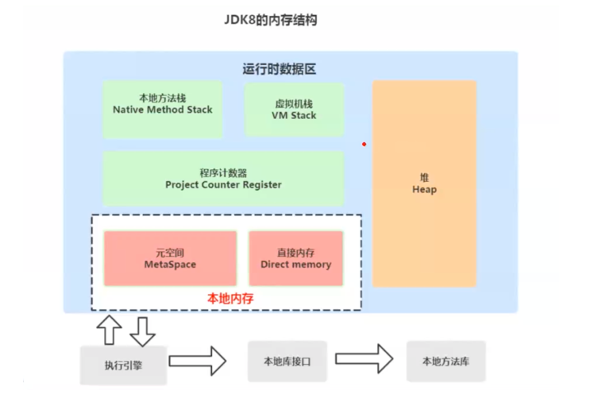

# 运行时数据区域总结
### jdk7内存结构

### jdk8内存结构

### jdk1.7和jdk1.8的内存调整
- 移除了永久代(PermGen)，替换为了元空间(Metaspace)；-
- 永久代中的类元信息(class metadata)转移到了本地内存(native meory)，而不是虚拟机；
- 永久代中的字符串常量池(interned Strings)和类静态变量(class static variables)转移到了Java heap；
- 永久代参数(PermSize MaxPermSize) --> 元空间参数(MetaspaceSize MaxMetaspaceSize) ;

### 方法区和永久代的关系
在Java虚拟机规范中，方法区在虚拟机启动的时候创建。永久代是Hotspot虚拟机特有的概念，是方法区的一种实现，别的JVM都没有这个东西。

### Java8的HotSpots取消了永久代，是不是就没有方法区的功能了？
- 不是的，方法区只是一个规范，它的功能并没有取消，而是被元空间和堆给瓜分了。

### Jdk 1.8的元空间和jdk 1.7的永久代的区别
- 存储位置不同：永久代在物理上是运行时数据区的一部分，和堆的地址是连续的；而元空间属于本地内存；
- 存储内容不同：1.7中永久代用于储存类的元数据信息、静态变量及运行时常量池等；在1.8中类的元数据信息存储在元空间中，静态变量和运行时常量池并在
了堆中。相当于永久代被元空间和堆给瓜分了。

### Jdk 8为什么要将永久代替换为Metaspace
- 常量池存在永久代中，容易出现性能问题和内存溢出。在永久代分离出来与类的元数据分开，提升类的元数据信息的独立性的同时提升GC效率；
- 类及方法的信息比较难确定其大小，因此对于永久代的大小指定比较困难。太小容易出现永久代溢出，太大则容易导致老年代溢出。元数据信息分配在本地内存
中，元空间最大分配空间就是系统的可用内存空间。不会遇到永久代存在时的内存溢出问题；
- 永久代会为GC带来不必要的复杂度，并且回收效率偏低；
- Oracle将HotSpot与JRockit合二为一，jRockit没有所谓的永久代；

