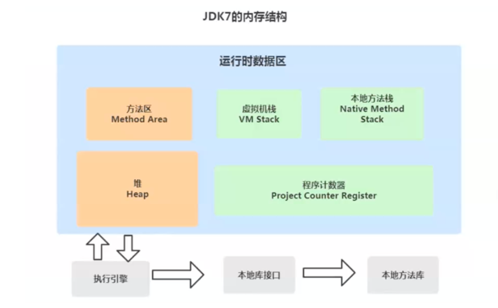
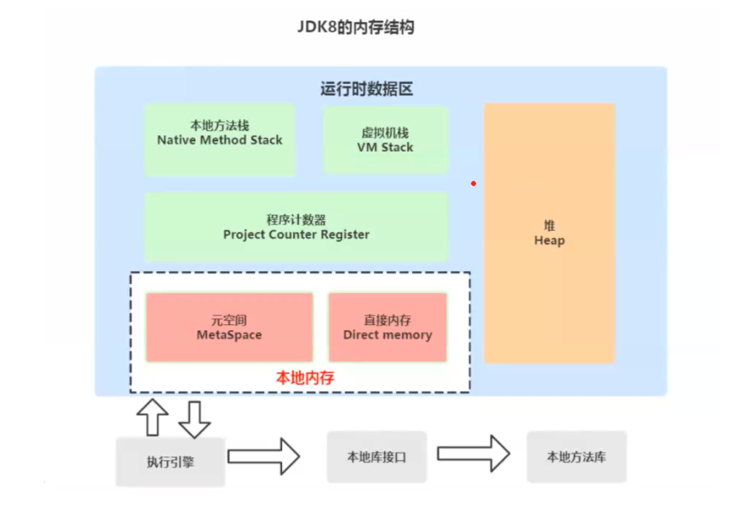
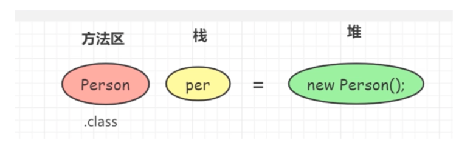

# 运行时数据区域总结

### jdk7内存结构

### jdk8内存结构

### jdk1.7和jdk8的内存调整
- 移除了永久代(PermGen)，替换为了元空间(Metaspace)；-
- 永久代中的类元信息(class metadata)转移到了本地内存(native meory)，而不是虚拟机；
- 永久代中的字符串常量池(interned Strings)和类静态变量(class static variables)转移到了Java heap；
- 永久代参数(PermSize MaxPermSize) --> 元空间参数(MetaspaceSize MaxMetaspaceSize) ;

### 方法区和永久代的关系
在Java虚拟机规范中，方法区在虚拟机启动的时候创建。永久代是Hotspot虚拟机特有的概念，是方法区的一种实现，别的JVM都没有这个东西。

### Java8的HotSpots取消了永久代，是不是就没有方法区的功能了？
- 不是的，方法区只是一个规范，它的功能并没有取消，而是被元空间和堆给瓜分了。

### Jdk 8的元空间和jdk 1.7的永久代的区别
- 存储位置不同：永久代在物理上是运行时数据区的一部分，和堆的地址是连续的；而元空间属于本地内存；
- 存储内容不同：1.7中永久代用于储存类的元数据信息、静态变量及运行时常量池等；在1.8中类的元数据信息存储在元空间中，静态变量和运行时常量池并在
了堆中。相当于永久代被元空间和堆给瓜分了。

### Jdk 8为什么要将永久代替换为Metaspace
- 常量池存在永久代中，容易出现性能问题和内存溢出。在永久代分离出来与类的元数据分开，提升类的元数据信息的独立性的同时提升GC效率；
- 类及方法的信息比较难确定其大小，因此对于永久代的大小指定比较困难。太小容易出现永久代溢出，太大则容易导致老年代溢出。元数据信息分配在本地内存
中，元空间最大分配空间就是系统的可用内存空间。不会遇到永久代存在时的内存溢出问题；
- 永久代会为GC带来不必要的复杂度，并且回收效率偏低；
- Oracle将HotSpot与JRockit合二为一，jRockit没有所谓的永久代；

### 方法区

1. 方法区存储的内容：类型信息(类信息、域信息、方法信息)、运行时常量池(运行时常量池、JIT代码缓存)。
   - 类型信息：
       - 类信息 \
         每个加载的类型(类 Class、接口 Interface、枚举 enum、注解 annotation)，JVM必须在方法区中存储以下类型信息：
           - 这个类型的完整有效名称（类的全限定名）；
           - 这个类型直接父类的完整有效名（对于interface或是java.lang.Object都没有父类）；
           - 这个类型的修饰符（public，abstract，final 的某个子集）；
           - 这个类型直接接口的一个有序列表；
       - 域信息 \
         域信息即为类的属性、成员变量：
           - JVM必须在方法区中保存类所有的成员变量相关信息及声明顺序；
           - 域的相关信息包括：域名称、域类型、域修饰符（public、private、protected、static、final、volatile、transient的某个子集）；
       - 方法信息 \
         JVM必须保存所有方法的以下信息，同域信息一样包括声明顺序：
           - 方法名称、方法的返回类型（或void）；
           - 方法参数的数量和类型（按顺序）；
           - 方法的修饰符（public、private、protected、static、final、volatile、transient的某个子集）；
           - 方法的字节码bytecodes、操作数栈、局部变量表及大小（abstract和native方法除外）；
           - 异常表（abstract和native方法除外）。每个异常处理的开始位置、结束位置、代码处理在程序计数器中的偏移地址、被捕获的异常类的常量池索引。		

### 常量池和运行时常量池
1. 常量池和运行时常量池的区别
   - 所在位置不同；\
   字节码文件中包含了常量池，方法区中包含了运行时常量池；
   - 作用不同；\
   常量池存放编译期间生成的各种字面量与符号引用；编译后的字节码文件中包含了类型信息、域信息和方法信息等，通过ClassLoader将字节码
文件中常量池的信息加载到内存中，存储在了方法区中的运行时常量池中。可以理解为字节码中的常量池Constant Pool 只是文件信息，他想要执行就必须加载
到内存中。而java程序是靠JVM的执行引擎来解释执行的。执行引擎在运行时常量池中取数据，被加载的字节码常量池中的信息是放到了方法区中的运行时常量池。
2. 为什么需要常量池 \
代码中引用多种数据结构，常量池可以将这些引用转变为符号引用，等到用到时再加载。提高性能。

### 直接内存
1. 为什么需要直接内存
   - 改善堆过大时垃圾回收效率，减少停顿。Full GC时会扫描堆内存，回收效率和堆大小成正比。native的内存由OS负责管理和回收，与JVM垃圾回收无关；
   - 减少内存在native堆和JVM堆中的拷贝过程，避免拷贝损耗，降低内存使用；
   - 可以突破JVM内存大小限制。直接内存不属于JVM，属于本地内存。
2. 直接内存大小 \
   直接内存的默认值和java堆的最大值一致；

