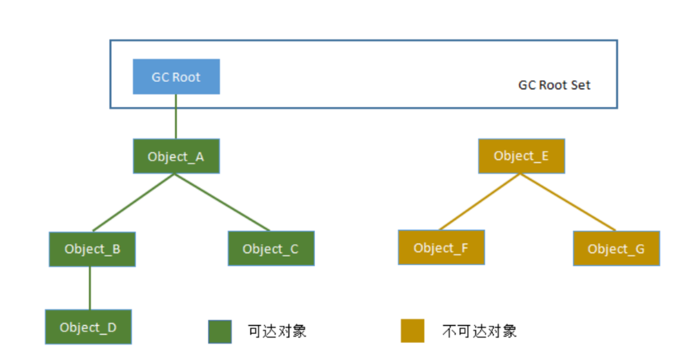

# 垃圾回收

## 哪些内存需要回收

在JDK1.2以前，Java中引用的定义很传统: 如果引用类型的数据中存储的数值代表的是另一块内存的起始地址，就称这块内存代表着一个引用。这种定义有些狭
隘 ，一个对象在这种定义下只有被引用或者没有被引用两种状态。我们希望能描述这一类对象: 当内存空间还足够时，则能保存在内存中；如果内存空间在进行垃
圾回收后还是非常紧张，则可以抛弃这些对象。很多系统中的缓存对象都符合这样的场景。在JDK1.2之后，Java对引用的概念做了扩充，将引用分为
强引用(Strong Reference) 、 软引用(Soft Reference) 、 弱引用(Weak Reference) 和 虚引 用(Phantom Reference) 四种，这四种引用的强度依次递减。

1. 强引用（StrongReference）
强引用是使用最普遍的引用。如果一个对象具有强引用，那垃圾回收器绝不会回收它。当内存空间不足，Java虚拟机宁愿抛出OutOfMemoryError错误，使程序
异常终止，也不会靠随意回收具有强引用的对象来解决内存不足的问题。

    `Objects = new Object();`

2. 软引用（SoftReference）
如果一个对象只具有软引用，则内存空间足够，垃圾回收器就不会回收它；如果内存空间不足了，就会回收这些对象的内存。只要垃圾回收器没有回收它，该对象就
可以被程序使用。软引用可以和一个引用队列（ReferenceQueue）联合使用，如果软引用所引用的对象被垃圾回收器回收，Java虚拟机就会把这个软引用加入到
与之关联的引用队列中。

    `SoftReference<String> softReference = new SoftReference<>("hello");`

3. 弱引用（WeakReference）
用来描述那些非必须对象， 但是它的强度比软引用更弱一些， 被弱引用关联的对象只能生存到下一次垃圾收集发生为止。当垃圾收集器开始工作， 无论当前内存
是否足够， 都会回收掉只 被弱引用关联的对象。在JDK 1.2版之后提供了WeakReference类来实现弱引用。弱引用可以和一个引用队列（ReferenceQueue）
联合使用，如果弱引用所引用的对象被垃圾回收，Java虚拟机就会把这个弱引用加入到与之关联的引用队列中。

    `WeakReference<String> hello = new WeakReference<>("hello");` 

4. 虚引用（PhantomReference）

“虚引用”顾名思义，它是最弱的一种引用关系。如果一个对象仅持有虚引用，在任何时候都可能被垃圾回收器回收。虚引用主要用来跟踪对象被垃圾回收器回收的活动。

```
ReferenceQueue<String> referenceQueue = new ReferenceQueue<>();
PhantomReference phantomReference = new PhantomReference("hello", referenceQueue);
````


**弱引用与软引用的区别在于：**
- 更短暂的生命周期;
- 一旦发现了只具有弱引用的对象，不管当前内存空间足够与否，都会回收它的内存。

**虚引用与软引用和弱引用的区别在于：**
- 虚引用必须和引用队列 （ReferenceQueue）联合使用。
- 当垃圾回收器准备回收一个对象时，如果发现它还有虚引用，就会在回收对象的内存之前，把这个虚引用加入到与之关联的引用队列中。

## 什么时候回收

### 判断对象是否死亡

#### 判断对象是否死亡的方法
   1. 引用计数算法
      - 实现原理：给每个对象添加一个引用计数器，每当此对象被某个地方引用时，计数值+1；引用失效时，计数值-1。当计数值为0时，表示对象已经不能被使用。
      - 特点：实现简单、效率高，但是无法检测出循环引用❷。       
   2. 可达性分析算法 \
   在主流的商用程序语言如Java、C#等的主流实现中，都是通过可达性分析(Reachability Analysis)来判断对象是否存活的。此算法的基本思路就是通过一
系列的“GC Roots”的对象作为起始点，从起始点开始向下搜索到对象的路径。搜索所经过的路径称为引用链(Reference Chain)，当一个对象到任何GC Roots
都没有引用链时，则表明对象“不可达”，即该对象是不可用的。

**<font color='red'>在Java语言中，可作为GC Roots的对象包括下面几种：</font>**
        - 栈帧中的局部变量表中的reference引用所引用的对象，譬如各个线程被调用的方法堆栈使用到的参数、局部变量、临时变量等
        - 方法区中类静态属性引用的对象。譬如Java类的引用类型静态变量。
        - 方法区中final常量引用的对象
        - 本地方法栈中JNI(Native方法)引用的对象
        - Java虚拟机内部的引用， 如基本数据类型对应的Class对象， 一些常驻的异常对象（比如 NullPointExcepiton、 OutOfMemoryError） 等， 还有系统类加载器。
        - 所有被同步锁（synchronized关键字） 持有的对象。
        - 反映Java虚拟机内部情况的JMXBean、 JVMTI中注册的回调、 本地代码缓存等。
#### 如何判断对象是否死亡的过程
即使在可达性分析算法中判定为不可达的对象， 也不是“非死不可”的， 这时候它们暂时还处于“缓 刑”阶段， 要真正宣告一个对象死亡， 至少要经历两次标记过程：
1. 第一次标记:
如果对象在进行可达性分析后发现没有与GC Roots相连接的引用链， 那它将会被第一次标记， 随后进行一次筛选， 筛选的条件是此对象是否有必要执行finalize()方法。
   - 没有必要:\
   假如对象没有覆盖finalize()方法， 或者finalize()方法已经被虚拟机调用过， 那么虚拟机将这两种情况都视为“没有必要执行”。
   - 有必要:\
   如果这个对象被判定为确有必要执行finalize()方法，那么该对象将会被放置在一个名为F-Queue的队列之中， 并在稍后由一条由虚拟机自动建立的、 
低调度优先级的Finalizer线程去执行它们的finalize()方法。finalize()方法是对象逃脱死亡命运的最后次机会，稍后收集器将对F-Queue中的对象进行
第二次小规模的标记，如果对象要在finalize()中成功拯救自己——只要重新与引用链上的任何一个对象建立关联即可，譬如把自己（this关键字）赋值给某个
类变量或者对象的成员变量，那在第二次标记时它将被移出“即将回收”的集合；如果对象这时候还没有逃脱，那基本上它就真的要被回收了。

## 垃圾收集算法
### 复制算法
1. 设计原则：
将可用内存按容量划分为大小相等的两块，每次只使用其中的一块。当这一块的内存用完了，就将还存活着的对象复制到另一块上，然后再把已使用的内存一次性清
理掉。
2. 优缺点
   1. 优点：实现简单，运行高效。
   2. 缺点：这种算法会产生大量内存复制的开销，内存浪费多。
 
### 标记清除
1. 设计原则：
算法分为"标记"和"清除"两个阶段：首先标记出所有需要回收的对象，在标记完成后，统一回收到所有被标记的对象。也可以反过来，标记存活的对象，统一回收
所有未被标记的对象。标记过程就是对象是否属于垃圾的判定过程。
2. 优缺点：
   1. 优点：内存浪费少。
   2. 缺点：
      1. 执行效率不稳定。如果java堆中包含大量对象，而且其中大部分是需要被回收的，这是必须进行大量的标记和清除动作，导致标记和清除两个过程的执
   行效率都随对象的数量增长而降低；
      2. 内存空间碎片化问题严重。标记、清除只后会产生大量不连续的内存碎片，空间碎片太多会导致当以后在程序运行过程中需要分配较大对象时无法找到
   足够的连续内存而不得步提前触发另一次垃圾收集动作。

### 标记整理
"标记-整理"算法的标记过程和"标记-清除"算法一样，但标记完成之后，"标记-整理"算法不是直接对可回收的对象清除，而是让所有存活的对象都向内存空间一端
移动，然后直接清理掉边界以外的内存。

### 分代收集
设计原则：
收集器应该将java堆划分出不同的区域，然后将回收对象依据其年龄分配到不同的区域之中存储。如果一个区域中大多数对象都是朝生夕死，难以熬过垃圾收集的话，
那么把他们集中放在一起，每次回收只关注如何保留少量存活而不是去标记大量将要被回收的对象，就能以较低代价回收到大量的空间；如果剩下的都是难以消亡的
对象，那么把他们集中放在一块，虚拟机就可以使用较低的频率来回收这个区域。这就同时兼顾了垃圾收集的时间开销和内存空间的有效利用。

## GC分类总结
### GC分类
GC收集器分为两种：一种是部分收集器（Partial GC），另一类是整堆收集器（Full GC）。
- 部分收集器(Partial GC)
   - 新生代收集 ( Minor GC / Young GC ) : 只是新生代的垃圾收集;
   - 老年代收集 ( Major GC / Old GC ): 只是老年代的垃圾收集 (CMS GC 单独回收老年代);
   - 混合收集 ( Mix GC ): 收集整个新生代和老年代的垃圾 ( G1会混合收集, region区域回收);
- 整堆收集器(Full GC)
   - 收集整个java堆和方法区的收集器

### 各种GC的触发条件：
- 年轻代GC (Minor GC)触发条件：
   - 年轻代空间不足，就会出发Minor GC。这里的年轻代单指Eden区，Suvivor区满不会触发垃圾收集；Minor GC会引发STW (stop the world)。暂停其他用户的线程，等垃圾回收线程结束后，其他用户线程才恢复；
- 老年代GC (Major GC)触发条件：
   - 老年代空间不足会尝试出发Minor GC，如果空间还是不足则触发Major GC。如果Major GC 空间仍然不足，则触发OOM。Major GC的速度比Minor GC慢10倍以上；
- 整堆收集 (Full GC)触发条件：
   - 调用System.gc系统会执行Full GC，但不是立即执行；
   - 老年代空间不足；
   - 方法区空间不足；

注意：调优过程要尽量减少Full GC的次数。

## JVM内存分配与回收策略
对象的=内存分配，理论上讲应该都是在堆上分配的。在经典分代的设计下，新生对象通常会分配在新生代中，少数情况下也可能直接分配在老年代。对象的分配并
不是固定的，《java虚拟机规范》并未规定新对象的创建和存储细节，这取决于虚拟机当前使用的是哪一种垃圾收集器，以及虚拟机中与内存相关的参数的设定。
（对象分配的时候可能经过即时编译后被拆散为标量类型并间接的在栈上分配）
- 对象优先在Eden分配 \
大多数情况下，对象在新生代Eden区中分配。当Eden区没有足够空间进行分配时，虚拟机将发起一次Young GC。
- 大对象直接进入老年代 \
大对象就是指需要大量连续内存空间的java对象，比如很长的字符串或者元素数量很庞大的数组。我们在写程序时需要避免，因为在分配空间时，它容易导致内存
明明还有不少空间时就提前触发垃圾收集，以获取足够的连续空间才能安置他们。而当复制对象时，大对象就意味着高额的内存复制开销。HotSpot虚拟机提供了
-XX:PretenureSizeThreshold参数，指定大于该设置值的对象直接在老年代上分配，这样做的目的就是避免在Eden区以及两个Survivor区之间来回复制，产
生大量的内存复制操作。
- 长期存活的对象将进入老年代 \
HotSpot虚拟机给每隔对象定义了一个对象年龄age计数器，存储在对象头中，用来实现分代收集管理堆内存。对象优先在Eden区里诞生，如果经历了一次YoungGC
后仍然存活，并且将其对象年龄设置为1岁。对象每熬过一次YoungGC，年龄就增加一岁，当他的年龄增加到一定程度（默认15）就会被晋升到老年代中。
- 动态对象年龄判定
如果在Survivor空间中相同年龄所有对象大小的总和大于Survivor空间的一半，年龄大于或等于该年龄的对象就可以直接进入老年代，无需等到年龄超过阈值。
- 空间分配担保 \
在发生YoungGC之前，虚拟机必须先检查老年代最大可用的连续空间是否大于新生代所有对象总空间。如果条件成立，那这一次YoungGC可以确保时安全的。如果
不成立，则虚拟机会先查看JVM是否允许担保失败。如果允许，那会继续检查老年代最大可用的连续空间是否大于历次晋升到老年代对象的平均大小。如果大于，将
尝试进行一次YoungGC，尽管这次YoungGC是有风险的；如果小于或者JVM不允许冒险，那这时就要改为进行一次FullGC


