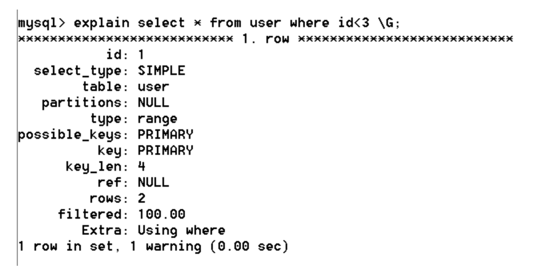
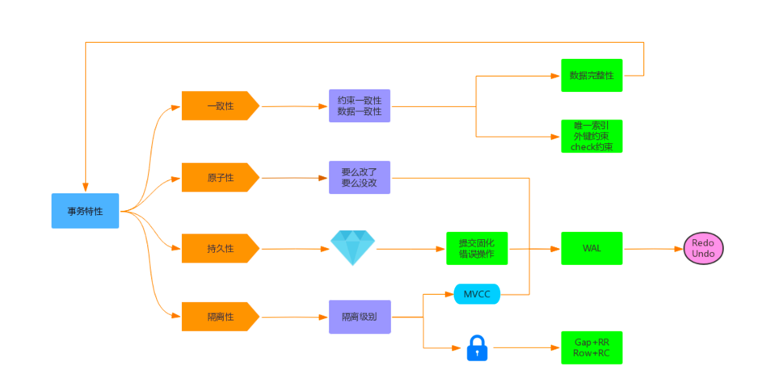
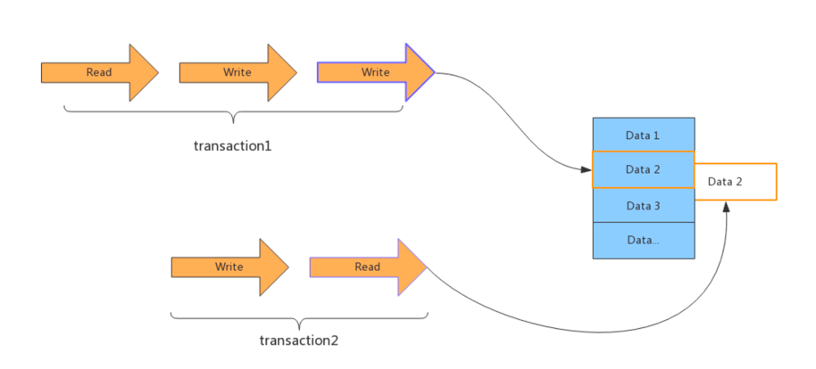

# mysql

## mysql常用存储引擎
1. InnoDB 和MyISAM对比
   - 事务和外键
       - InnoDB 支持事务和外键，具有安全性和完整性。适合大量的insert和update操作；
       - MyISAM 不支持事务和外键，它提供高速存储和检索。适合大量的select操作；
   - 锁机制
       - InnoDB 支持行级锁，锁定指定记录。基于索引来加锁实现；
       - MyISAM支持表级锁，锁定整张表；
   - 索引结构
       - InnoDB 使用聚簇索引，索引和记录一起存储；
       - MyISAM使用非聚簇索引，索引和记录分开存储；
   - 并发处理能力
       - MyISAM使用表锁，导致写操作并发率低，读读之间不阻塞，读写阻塞；
       - InnoDB 读写阻塞可以和隔离级别有关，可采用MVCC支持高并发；
   - 存储文件
       - InnoDB 对应两个文件，一个是.frm表结构文件，一个是.idb表数据文件。InnoDB 最大支持64TB；
       - MyISAM对应三个文件，一个是.frm表结构文件，一个是.MYD表数据文件，一个是.MYI索引文件。从MySQL5.0开始，MyISAM默认最大限制256TB；
       
2. InnoDB和MyISAM适用场景
    1. MyISAM
        - 不支持事务；
        - 并发相对较低（锁机制问题）；
        - 数据修改相对较少，以读为主；
        - 适用于数据一致性要求不高的场所；
    2. InnoDB
        - 具有较好的事务特性；
        - 行级锁对并发有较好的适应能力；
        - 适用于数据更新较为频繁的场景；
        - 适用于数据一致性要求较高的场所；
        - 硬件设备内存较大，可以利用InnoDB 较好的缓存能力来提高内存利用率，减少磁盘IO。

## mysql的Undo Log、Redo Log和Binlog
### Undo Log
   1. Undo Log 属于逻辑日志，记录一个变化过程。执行一个delete会记录一个相反的insert；它是在数据库事务开始之前，将要修改的记录存放到Undo Log
里，当事务回滚或数据库崩溃时利用Undo Log日志，撤销未提交事务对数据库产生的影响。 
   2. Undo Log在事务开始前产生；事务在提交时，并不会立即删除Undo Log，InnoDB 会将该事务对应的Undo Log放到删除列表中，后面会通过后台线程
purge thread进行回收处理。
       - Undo Log作用
           - 实现事务的原子性：Undo Log是为了实现事务的原子性而出现的产物。事务处理过程中，如果出现了错误或者用户执行了Rollback语句，mysql
         可以利用Undo Log中的备份将数据恢复到事务开始之前的状态。
           - 实现多版本并发控制（MVCC）：Undo Log在Mysql InnoDB 存储引擎中用来实现MVCC。事务未提交前，Undo Log保存了未提交之前的版本数
         据，Undo Log中的数据可作为数据旧版本快照供其他并发事务进行快照读。
### Redo Log（物理日志）
- Redo Log是InnoDB 引擎所特有的日志，以恢复操作为目的，在数据库发生意外时重现操作。Redo Log文件内容是以顺序循环的方式写入文件，写满时则回溯
到第一个文件，进行覆盖写。
- Redo Log是为了实现事务的持久性而出现的产物。防止在发生故障的时间点，尚有脏页未写入表的idb文件中，在重启mysql服务的时候，根据Redo Log进行
重做，从而达到事务的未入磁盘数据进行持久化这一特性。
- Redo Log 有两个指针Write Pos和CheckPoint
    - Writr Pos是当前记录的位置，一边写一边后移，写到最后一个文件末尾后就回到0号文件开头；
    - CheckPoint是当前要擦除的位置，也是往后推移并且循环的，擦除数据前要把数据更新到数据文件；
    - Write Pos和Check Point之间还空着的部分，可以用来记录新的操作。如果Write Pos追上CheckPoint时表示写满，这时就不能再执行新的更新，得
停下来先擦掉一些记录，把CheckPoint推进一下。

### Binlog （Binary log  - 二进制日志、逻辑日志）
- Binlog 是记录所有数据库表结构变更和表数据修改的二进制日志，不会记录select和show这类操作。Binlog 是以事件形式记录，还包含了语句所执行的消耗时间。
- 开启Binlog有以下两个最重要的使用场景：
    - 主从复制：在主库开启Binlog功能，这样主库就可以把Binlog传递给从库，从库拿到binlog后实现数据恢复，达到主从数据一致；
    - 数据恢复：通过mysqlbinlog 工具来恢复数据。

### Redo Log和Binlog的区别：
- Redo Log是属于InnoDB 引擎功能，Binlog是属于Mysql Server自带的功能，并且是以二进制文件记录；
- Redo Log属于物理日志，记录该数据页更新状态内容；Binlog 是逻辑日志，记录更新过程；
- Redo Log日志是循环写，日志空间大小固定；Binlog 是追加写，不会覆盖使用。

## MySQL索引
### MySQL索引类型
- 按照索引存储结构划分：B Tree索引、Hash索引、FULLTEXT索引、R Tree索引；
- 按照应用层次划分：普通索引、唯一索引、主键索引、复合索引；
- 按照索引键值划分：主键索引、辅助索引（二级索引）；
- 按照数据存储和索引键值逻辑关系划分：聚簇索引、非聚簇索引；

### 全文索引
- 查询操作在数据量比较少的时候，可以用like模糊查询。但是对于大量的文本数据检索，效率很低。可以使用全文索引，查询速度比like块很多倍。在MySQL5.6
之前的版本，只有MyISAM存储引擎支持全文索引；从MySQL5.6开始MyISAM和InnoDB 存储引擎均支持；
- 全文索引必须在字符串和文本字段上建立；
- 全文索引字段值必须在最小字符和最大字符之间才有效；（InnoDB：3～84，MyISAM：4～84）
- 全文索引字段值要进行切词处理。按syntax字符进行切割，例如：b+aaa切成b和aaa;
- 全文索引匹配查询，默认使用的是等值匹配，例如a匹配a,而不会匹配ab、ac。如果模糊匹配可以在boolean模式下搜索a*;
```sql
    select * from user where match(name) against('a*' in boolean mode);
```

### 哈希索引
- Hash索引非常适合等值查询，范围查询就需要全表扫描了。主要应用在Memory原生的hash索引、InnoDB自适应哈希索引；
- InnoDB自适应哈希索引为了提升查询效率，InnoDB 存储引擎会监控表上各个索引页的查询。当InnoDB注意到某些索引值访问非常频繁时，会在内存中基于
B+ Tree索引再创建一个哈希索引，使得内存中的B+ Tree索引具备了哈希索引的功能。即：能够快速定值访问频繁访问的索引页；
- 哈希索引一次性查找就能够定位数据，等值查询效率要优于B+ Tree；
- 自适应哈希索引的建立，使得InnoDB 存储引擎能够自动根据索引页访问的频率和模式，自动的为某些热点页建立哈希索引来加速访问。
- InnoDB自适应哈希索引的功能，用户只能选择开启或关闭，无法进行人工干涉。

### B+ Tree索引
MySQL是采用B+ Tree结构，它是在B- Tree上做的优化。
- B- Tree的结构
    - 每个节点可以存放索引值和对应的data数据；
    - 树节点中的多个索引值从左到右 升序排序；
    - B- Tree的搜索：从根节点开始，对节点内的索引值序列采用二分查找。如果命中就结束查找，如果未命中就进入子节点中重复查找过程，直到所对应的节点
指针为空，或已经是叶子节点了才结束。
- B+ Tree的结构
    - 叶子节点包含了完整的索引值和data数据，非叶子结点只保存索引值，因此他的查询时间固定为log(n)；
    - 叶子节点之间用指针连接，类似于一个单链表，提高了叶子节点的区间访问性能；
    - B+树更适合于外部存储。因为他非叶子结点不存储数据，只存储索引。
    - 相比B- Tree，B+ Tree在进行范围查找时，只需要查找定位两个节点的索引值，然后利用叶子节点的指针进行遍历即可；而B- Tree则需要遍历范围内
所有的节点和数据，显然B+ Tree效率高；

### 聚簇索引和辅助索引
1. 索引介绍
    - 聚簇索引和非聚簇索引：B+ Tree的叶子节点存放主键索引值和行记录就属于聚簇索引；如果主键索引值和行记录分开存储就属于非聚簇索引；
    - 主键索引和辅助索引：B+ Tree的叶子节点存放的是主键字段值就属于主键索引；如果存放的是非主键值就属于辅助索引（二级索引）；
2. 索引详细介绍
    - 聚簇索引是一种数据存储方式，InnoDB的聚簇索引就是按照主键顺序构建B+ Tree结构。B+ Tree的叶子节点就是主键行记录，行记录和主键值紧凑的存储
在一起。这也就意味着InnoDB 的主键索引就是数据表本身，它按主键顺序存放了整张表的数据，占用的空间就是整张表数据量的大小。
        - InnoDB的表要求必须要有聚簇索引
            - 如果表定义了主键，则主键索引就是聚簇索引；
            - 如果表没有定义主键，则第一个非空的唯一列就是聚簇索引；
            - 否则InnoDB 会重建一个隐藏的row-id作为聚簇索引；
    - 辅助索引（二级索引）
      - 辅助索引是根据索引列构造的B+ Tree结构。但在B+ Tree 的叶子节点中只存了索引列和主键数据，二级索引占用的空间会比聚簇索引小很多，创建
    辅助索引就是为了提高查询效率。一个InnoDB 表只能创建一个聚簇索引，但可以创建多个辅助索引。
    - 非聚簇索引
      - 与InnoDB表存储不同，MyISAM数据表的索引文件和数据文件是分开的。索引文件是.MYI，数据文件是.MYD。

## 索引的执行计划

1. select_type：表示的查询类型
    - SIMPLE：表示查询语句不包含子查询和union;
    - PRIMARY：表示此查询是最外层的查询；
    - UNION: 表示此查询是UNION的第二个或后续的查询；
    - DEPENDENT UNION：表示此查询是UNION的第二个或后续的查询，并用到了外面的查询结果；
    - UNION RESULT：UNION的查询结果；
    - SUBQUERY：select子查询语句；
    - DEPENDENT SUBQUERY：select子查询语句依赖外层的查询结果；
2. type \
表示存储引擎查询数据时采用的方式。通过他可以判断是全表扫描还是基于索引的部分扫描。常用属性值如下，从上至下效率依次增强。
    1. ALL：表示全表扫描，性能最差；
    2. index：表示基于索引的全表扫描，先扫描索引，再扫描全表数据；
    3. rang：表示使用索引范围查询。使用>、>=、<、<=、in等；
    4. ref：表示使用非唯一索引进行单值查询；
    5. eq_ref：一般情况下出现在多表join查询中，表示前面表的每一个记录，都只能匹配后面表的一行结果；
    6. const：表示使用主键或唯一索引做等值查询，常量查询；
    7. NULL：表示不用访问表，速度最快。
3. possible_keys \
表示查询时能够使用到的索引。注意，并不一定会真正使用，显示的是索引名称；
4. key \
   表示查询时真正使用到的索引，显示的是索引名称；
5. rows \
   mysql查询优化器会根据统计信息，估算sql 查询到结果需要扫描多少行记录。原则上rows是越少效率越高，可以直观的了解到SQL 效率的高低；
6. key_len \
   表示查询使用索引的字节数量。可以判断是否全部使用了组合索引；\
   key_len的计算规则

   | 类型           | 计算规则                                                     |                |
   | -------------- | ------------------------------------------------------------ | -------------- |
   | **字符串类型** | 字符串长度和字符集有关：latin=1、gbk=2、utf8=3、utf8mb4=4    |                |
   | char(n)        | n * 字符集长度                                               |                |
   | varchar(n)     | n * 字符集长度 + 2                                           |                |
   | **数值类型**   |                                                              |                |
   | TINYINT        | 1 个字节                                                     |                |
   | SMALLINT       | 2 个字节                                                     |                |
   | MEDIUMINT      | 3 个字节                                                     |                |
   | INT、FLOAT     | 4 个字节                                                     |                |
   | BIGINT、DOUBLE | 8 个字节                                                     |                |
   | **时间类型**   |                                                              |                |
   | DATA           | 3 个字节                                                     |                |
   | TIMESTAMP      | 4 个字节                                                     |                |
   | DATATIME       | 8 个字节                                                     |                |
   | **字段属性**   |                                                              |                |
   | NULL           | 1 个字节，如果一个字段设置了NOT NULL，则没有此项             |                |
   | 例如：         | 表的字符集为utf8mb4，where条件字段的类型是varchar(64)，则key_len = 258 | key_len=4*64+2 |
7. Extra \
   表示很多的额外信息，各种操作会在Extra提示相关信息。常见如下：
    - Using where \
      表示查询需要通过索引回表查询数据；
    - Using index \
      表示查询需要通过索引，索引就可以满足所需的数据；
    - Using filesort \
      表示查询出来的结果需要额外排序。数据量小的话在内存排，大的话在磁盘排序，因此有Using filesort建议优化；
    - Using temprorary \
      查询使用到了临时表，一般出现于去重、分组等操作；

## 索引和排序
mysql支持filesort和index两种方式的排序。
- filesort是先把结果查出然后在缓存或磁盘进行排序，效率较低。
- index是只使用索引自动实现排序，不需另作排序操作，效率比较高。
### filesort排序总结 \
filesort有两种排序算法，双路排序和单路排序
- 双路排序：需要进行两次磁盘读取，最终得到用户数据。第一次将排序字段读取出来，然后排序；第二次去读取其他字段数据；
- 单路排序：从磁盘查询所需的所有列数据，然后在内存排序将结果返回。如果查询数据超出缓存sort_buffer，会导致多次磁盘读取操作，并创建临时表，最后
产生多次IO，反而会增加负担。解决方案：少使用select *；增加sort_buffer_size容量和max_length_for_sort_data容量。\
#### 总结
- 如果我们使用explain分析sql时，Extra中的属性显示Using filesort，表示使用filesort排序方式，需要优化；
- 如果Extra属性显示Using index时，表示使用到了覆盖索引，所有操作在索引上完成，也可以使用index排序方式。建议大家尽可能使用覆盖索引。

## 其他概念
### 回表查询
InnoDB索引有聚簇索引和辅助索引。聚簇索引的叶子节点存储行记录，InnoDB 必须要有，且只有一个。辅助索引的叶子节点存储的是主键值和索引字段值，通过
辅助无法定位到行记录。通常情况下需要扫描两遍索引树。先通过辅助索引定位主键值，然后再通过聚簇索引定位行记录，这就叫做回表查询。他的性能比扫描一遍索引树低。
### 覆盖索引
只要在一棵索引树上就能够获取sql所需的所有列数据，无需回表，就叫做索引覆盖；\
**实现索引覆盖最常见的方法是：将被查询的字段建立到组合索引。**
### 最左前缀原则
在查询中复合索引使用到最左边的列，那么查询就会使用到索引；
这是因为我们基于B+ Tree的mysql复合索引，是基于左边的字段构成的，不可以跨过左边的字段，直接查找右边的字段，否则复合索引将会失去作用，变成全表扫描。
### NULL查询
- NULL意味着一个未知值。他不能使用<、>、=这样的运算符，因为对NULL做运算的结果都是null；count时不会包括null行；NULL比空字符串需要更多的存储空间等。
NULL需要增加额外的空间记录其值是否为null。对于MyISAM 表，每一个空列额外占用一位，四舍五入到最接近的字节。
- 虽然Mysql可以在含有null的列上使用索引，但null和其他数据还是有区别的，不建议列上允许为null，最好设置成not null并给一个默认值，比如“0”和空字符串等；
如果是datetime类型也可以设置系统当前时间或某个固定的特殊值。

## 查询优化
### 慢查询定位
1. 开启慢查询日志
```sql
    ## 查看mysql是否开启了慢查询日志和慢查询日志文件的存储位置
    SHOW VARIABLES LIKE 'slow_query_log%'    
    ## 通过如下命令开启慢查询日志
    SET global slow_query_log = ON; 
    SET global slow_query_log_file = 'OAK-slow.log'; 
    SET global log_queries_not_using_indexes = ON; 
    SET long_query_time = 10;
    # long_query_time：指定慢查询的阀值，单位秒。如果SQL执行时间超过阀值，就属于慢查询记录到日志文件中。
    # log_queries_not_using_indexes：表示会记录没有使用索引的查询SQL。前提是slow_query_log的值为ON，否则不会奏效。
   ```
2. 查看慢查询日志
   - 文本方式查看
     - 使用慢查询日志分析工具mysqldumpslow查看
     ```sql
        ## 在 MySQL bin目录下执行下面命令可以查看该使用格式。
        perl mysqldumpslow.pl --help
        ## 运行如下命令查看慢查询日志信息：
        perl mysqldumpslow.pl -t 5 -s at C:\ProgramData\MySQL\Data\OAK-slow.log
     ```
   - 使用第三方分析工具：pt-query-digest、mysqlsla
3. 慢查询优化
    1. 如何判断sql 是否是慢查询 
       - 打开慢查询日志，对比sql的执行时间和long_query_time，sql执行时间 > long_query_time是慢查询。慢查询日志里的都是大于long_query_time的。long_query_time默认值是10S，我们可以自己调整。
    2. 如何判断是否应用了索引
       - explain结果中的key展示了使用到的索引。
    3. 应用索引是否一定快
        ```sql
            select * from user where id>0;
            此sql虽然使用了索引，但还是从主键索引最左边的叶子节点开始扫描整个索引树，进行了全表扫描，此时索引就失去了意义。sql是否使用了索引只表示一个sql语句的执行过程；而是否为慢查询，是由sql的执行时间决定的，也就是说是否使用了索引和是否是慢查询两者之间没有必然的联系。我们在关注索引时，不要只关注是否起作用，还要关注索引是否减少了查询扫描的行数，只有扫描的行数减少了性能才能提升。对于一个大表，不止要创建索引还要考虑过滤性能，过滤性好性能才能提升。
        ```
    4. 提高索引过滤性
       索引过滤性与索引字段、表的数量和表设计结构都有关系。
        - 慢索引需要优化的原因总结
            - 全表扫描：explain分析type属性all；
            - 全索引扫描：explain分析type属性index；
            - 索引过滤性不好：索引字段选型、数据量、状态和表设计；
            - 频繁的回表查询开销，使用覆盖索引，尽量少使用select * 。
4. 分页查询优化
    1. 分页查询导致的问题
        - 一般性分页使用简单的limit子句就可完成；
        - 如果偏移量固定，返回的记录数低于100条，查询时间差距不大。随着查询记录量越大，所花费的时间也越来越多；
        - 如果查询记录量相当，偏移量超过100后，查询时间会随着偏移量的增大而急剧增大。这种分页机制，每次都从数据库第一条记录开始扫描，越往后查询越慢；而且查询的数据越多，也会拖慢总查询的速度。
    2. 分页优化方案
        - 使用覆盖索引优化；
        - 利用子查询优化；
            ```sql
                select * from user limit 10000,100; 
                select * from user where id >= (select id from user limit 10000,1) limit 100;
                # 使用ID做主键比较，并且子查询使用了覆盖索引进行优化。
            ```
## MySQL的事务
### ACID

1. 原子性
   修改 --> Buffer Pool修改 --> 刷盘
    - **如果事务提交了，如果此时Buffer pool脏页没有刷盘，如何保证修改的数据生效？Redo**
    - **如果事务没有提交，但是Buffer pool脏页已经刷盘了，如何保证不该存在的数据撤销？Undo**
    - 每写一个事务都会修改Buffer pool，从而产生相应的Redo/Undo日志。在Buffer pool中的页被刷到磁盘之前，这些日志信息都会先写入到日志文件中。
如果事务提交了，buffer pool中的脏页没有刷成功，此时数据库挂了，那在数据库再次启动之后可以通过redo 日志将其恢复过来，以保证脏页写的数据不会丢失；
如果事务没有提交，脏页刷新成功，此时数据库挂了，就需要Undo来取消操作。
2. 一致性
   一致性包括两方面的内容，分别指约束一致性和数据一致性。
    - 约束一致性：
      创建表结构时所指定的外键、check、唯一索引等约束。但是MySQL中不支持check；
    - 数据一致性
      它是由原子性、持久性、隔离性共同保证的结果，而不是单单依赖于某一种技术；\
   数据的一致性是通过原子性、隔离性、持久性来保证，而这3个特性又通过Redo/Undo来保证。逻辑上的一致性包括唯一索引、外键约束、check约束，这属于业务逻辑范畴。\
   WAL：Write-Ahead Logging。先写日志，再写磁盘。
3. 隔离性
   InnoDB 支持的隔离性有4种，从低到高是读未提交、读已提交、可重复读和串型化。锁和多版本并发控制（MVCC）就是保证隔离性的
4. 持久性

mysql的持久性也和WAL技术有关，redo log 在系统Crash重启之类的情况时，可以修复数据，从而保证事务的持久性；通过原子性可以保证逻辑上的持久性；
通过存储引擎的数据刷盘可以保证物理上的持久性。

### 事务的演进
#### 并发事务
1. 更新丢失 \
  当两个或多个事务更新同一行记录时，会产生更新丢失现象。
    - 回滚覆盖：一个事务回滚操作，把其他事务已回滚的数据给覆盖了；
    - 提交覆盖：一个事务提交操作，把其他事务已提交的数据给覆盖了；
2. 脏读 \
  一个事务读取到了另一个事务修改但未提交的数据；
3. 不可重复度 \
  一个事务多次读取同一行记录，后面读取的跟前面读取的数据不一致；
4. 幻读 \
  一个事务多次按相同的条件查询，后面查询的结果和前面查询的结果不同，多了或少了几行记录；
#### 事务的隔离级别
| 事务隔离级别 | 回滚覆盖 | 脏读     | 不可重复度 | 提交覆盖 | 幻读     |
| ------------ | -------- | -------- | ---------- | -------- | -------- |
| 读未提交     | ❌        | 可能发生 | 可能发生   | 可能发生 | 可能发生 |
| 读已提交     | ❌        | ❌        | 可能发生   | 可能发生 | 可能发生 |
| 可重复读     | ❌        | ❌        | ❌          | ❌        | 可能发生 |
| 串型化       | ❌        | ❌        | ❌          | ❌        | ❌        |

- 事务的隔离级别和锁的关系
    - 事务的隔离级别是sql92定制的标准，相当于事务并发控制的整体解决方案。事务的隔离级别本质上是对锁和MVCC的封装，隐藏了底层的细节；
    - 锁是数据库实现并发控制的基础，事务的隔离性是采用锁来实现的，对相应操作加不同的锁，就可以防止其他事务同时对数据进行读写操作；
    - 对用户来说首先选择使用隔离级别，当选用的隔离级别不能解决并发问题或需求时，才有必要在开发中手动设置锁。
    - 一般使用时，建议采用默认隔离级别，存在的一些并发问题可以通过悲观锁、乐观锁等实现处理。
        - mysql默认隔离级别：可重复读；
        - Oracel、SQLServer默认隔离级别：读已提交


### MVCC
多版本并发控制MVCC，也就是Copy on Write思想。MVCC除了支持读和读并行，还支持读和写并行、写和读并行，但为了保持数据一致性，写和写是无法并行的。
如下图，在事务1写的时候会copy一个记录的副本，其他事务的读操作会读取这个记录的副本，因此不影响其他事务对此记录的写入，实现写和读并行。

- MVCC 概念 \
MVCC（Multi Version Concurrency Control）被称为多版本并发控制，是指在数据库中为了实现高并发的数据访问，对数据进行多版本处理，并通过事务的可见性来保证事务能看到自己应该看到的数据版本。多版本并发控制很巧妙的将稀缺资源的独占互斥转变为并发，大大提高了数据库的吞吐量和读写性能。
- 如何生成多版本？\
每次事务修改操作前，都会在Undo日志中记录**修改之前的数据状态和事务号**，该备份记录可以用于其他事务的读取，也可以进行必要时的数据回滚。
- MVCC实现原理
  - MVCC最大的好处是读不加锁，读写不冲突，极大的提升系统的并发性能。目前MVCC只在Read Commited和Repeatable Read下工作。
  - 在MVCC并发控制中，读操作可以分为两类：快照读（Snapshot Read）和当前读（Current Read）：
    - 快照读：读取的是记录的快照版本（有可能是历史版本），不用加锁（select）；
    - 当前读：读取的是记录的最新版本，并且当前读返回的记录都会加锁，保证其他事务不会再并发修改这条记录。（select ··· for update 或 lock in share mode, insert/delete/update）
- MVCC已经解决了读读、读写、写读并发，如果想进一步解决写写冲突，可采用下面两种方案：
  - 乐观锁
  - 悲观锁

## MySQL 的锁机制
1. 锁分类
    - 按操作粒度分
        - 表级锁 \
          每次操作锁住整张表。锁定粒度大、锁冲突概率高、并发度低。应用在MyISAM、InnoDB、BDB等存储引擎中；
        - 行级锁 \
          每次操作锁住一行数据。锁定粒度小、锁冲突概率低、并发度高。应用在InnoDB存储引擎中；
        - 页级锁 \
          每次锁住相邻的一组记录，锁定粒度在行锁和表锁之间，开销和加锁时间介于行锁和表锁之间，并发度一般。应用于BDB存储引擎中。
    - 按操作类型分
        - 行级读锁（S锁）共享锁：针对同一份数据，多个读操作可以同时进行而不会相互影响； \
      事务A对记录添加了S锁，可以对记录进行读操作，不能做修改。其他事务可以对该记录追加S锁，但不能追加X锁。若要追加X锁需要等待S锁全部释放；
        - 行级写锁（X锁）排他锁：当前写操作没有完成之前，他会阻断其他写锁和读锁； \
      务对A记录添加了X锁，可以对记录进行读和修改操作，其他事务不能对记录进行读和修改操作；
        - IS锁和IX锁：意向读锁和意向写锁，属于表级锁。S锁和X锁主要针对行级锁，在对表记录添加S锁和X锁之前都会对表添加IS锁或IX锁。
    - 按操作性能分
      - 乐观锁 \ 
      一般的实现方式是对记录版本进行比对，在数据更新提交的时候才会进行冲突检测。如果发现冲突了则提示错误信息；
      - 悲观锁 \
      在对一条数据修改的时候，为了避免同时被其他人修改，使用在修改数据之前先锁定、再修改的控制方式。共享锁和排他锁是悲观锁的不同实现。
2. 行锁 \
   行锁分为共享锁和排他锁。InnoDB行锁是通过对索引数据页上的记录加锁实现的，主要实现算法有三种：Record Lock、Gap Lock和Next-key Lock。
    - Record Lock（记录锁）：锁定单个行记录的锁。可重复读、读已提交级别都支持；
    - Gap Lock（间隙锁）：锁定索引记录间隙，确保索引记录的间隙不变。（也叫范围锁）可重复读隔离级别支持；
    - Next-key Lock（记录锁 + 间隙锁）：同时锁定数据和数据前后的范围。可重复读隔离级别支持；\
      在可重复读隔离级别，InnoDB对于记录加锁行为都是先采用Next-key Lock，但是当sql操作含有唯一索引时，InnoDB会对Next-key Lock 进行优化，降级为Record Lock，仅锁住索引本身而非范围。
3. 悲观锁
    - 行锁、表锁、读锁、写锁、共享锁、排他锁都属于悲观锁；
    - 表级读锁会阻塞写操作，但不会阻塞读操作；而写锁会把读写都阻塞；
    - 共享锁也是行级读锁，是多个事务对同一数据可以共享一把锁，都能访问到数据，但不能修改。使用方法是select ··· lock in share mode，只适用于查询语句。事务使用了共享锁，只能读取不能修改，修改操作被阻塞；
    - 排他锁也是行级写锁，如果一个事务获取了一个记录的排他锁，其他事务就不能对该记录做其他操作，也不能获取该行的锁。使用方式是select ··· for update。innoDB 会默认在update\delete语句上加for update。行级锁的实现其实是依靠其对应的索引，如果操作没有用到索引的查询，那么会锁住全表记录。事务使用了排他锁，当前事务可以读取和修改，其他事务不能修改，也不能获取排他锁。如果查询没有使用到索引，将会锁住整个表记录。
4. 乐观锁 \
乐观锁在数据库操作是不会检测冲突，而是在提交时才检测冲突。悲观锁和乐观锁都可以解决写写并发，在应用时可以根据并发处理能力选择区分：对并发率要求高的选择乐观锁；对并发率要求低的可以选择悲观锁；
    - 乐观锁实现原理
        - 使用版本号 \
          给数据表增加一个版本号字段，每操作一次，将那条记录的版本号加1。version是用来查看被读的记录有无变化。作用是防止记录在业务处理期间被其他事务修改；
        - 使用时间戳 \
          与使用version版本类似，在数据表添加一个时间戳字段。在更新提交的时候检查当前数据库中的时间戳和自己更新前取到的时间戳对比。如果一致则提交更新，不一致则版本冲突。
5. 死锁与解决方案
    1. 表锁死锁
        - 产生原因 \ 
       用户A访问表A（锁住了表A），然后又访问表B；另一个用户B访问表B（锁住了表B），然后企图访问表A；这时用户A由于用户B已经锁住表B，它必须等待用户B释放表B才能继续，同样用户B要等用户A释放表A才能继续，这就死锁就产生了。
        - 解决方案 \
       调整程序逻辑，每次都按照相同的顺序锁定资源。
    2. 行级锁死锁
        - 产生原因1 \
          在事务中执行一条没有索引条件的查询，引发全表扫描，把行级锁上升为全表记录锁定（等价于表锁），多个这样的事务执行后就容易产生死锁和阻塞，最终程序会变慢，发生死锁或阻塞。
        - 解决方案1
          - sql语句不要使用太复杂的关联多表的查询；
          - 使用explain“执行计划”对SQL进行分析，对于有全表扫描和全表锁定的SQL语句，简历适当的索引进行优化；
        - 产生原因2 \
          两个事务分别想拿到对方持有的锁，互相等待，于是产生死锁。
        - 解决方案2
          - 在同一个事务中，尽可能做到一次锁定所需要的所有资源；
          - 按照ID排序，然后按照顺序锁定资源；
    3. 共享锁转换为排他锁
       - 事务A查询一条记录，然后更新该条记录；此时事务B也更新该条记录。这时事务B由于事务A有共享锁，必须等待事务A释放共享锁后才能获取排他锁，只能排队等待。事务A在执行更新操作时此处发生死锁。因为事务A需要排他锁来做更新操作，但是无法授予该锁请求。因为事务B已经有一个排他锁请求，并且正在等待事务A释放其共享锁。
       ```sql
        ##事务A:
        select * from dept where deptno=1 lock in share mode; //共享锁,1
        update dept set dname='java' where deptno=1;//排他锁,3
        ##事务B:
        update dept set dname='Java' where deptno=1;//由于1有共享锁，没法获取排他锁，需等待
       ```
       - 解决方案
         - 对于按钮等控件点击立刻失效，不让用户重复点击。避免引发同时对同一记录多次操作。
         - 使用乐观锁进行控制。乐观锁避免了长事务中的数据库加锁开销，大大提升了大并发量下的系统性能。需注意：由于乐观锁机制是在我们系统中实现的，来自外部系统用户的更新操作不受我们系统的控制，因此可能造成脏数据被更新到数据库中。
6. 死锁排查
   - 查看死锁日志 \
     通过**show engine innodb status\G**命令查看近期死锁日志信息。 \
     使用方法：1、查看近期死锁日志信息；2、使用explain查看下SQL执行
   - 查看锁状态变量 \
     通过**show status like'innodb_row_lock%‘**命令检查状态变量，分析系统中的行锁的争夺情况
     - Innodb_row_lock_current_waits：当前正在等待锁的数量
     - Innodb_row_lock_time：从系统启动到现在锁定总时间长度
     - Innodb_row_lock_time_avg： 每次等待锁的平均时间
     - Innodb_row_lock_time_max：从系统启动到现在等待最长的一次锁的时间
     - Innodb_row_lock_waits：系统启动后到现在总共等待的次数 \
     如果等待次数高，而且每次等待时间长，需要分析系统中为什么会有如此多的等待，然后着手定制优化。

## MySQL性能优化
- 优化成本：硬件升级  > 系统配置 > 表结构设计 > SQL语句及索引
- 优化效果：硬件升级 < 系统配置 < 表结构设计 < SQL语句及索引
### 系统配置优化
1. 保证从内存中读取数据 \
   MySQL会在内存中保存一定的数据，通过LRU算法将不常访问的数据保存在硬盘文件中。尽可能的扩大内存中的数据量，将数据保存在内存中，从内存中读取数据，可以提升MySQL性能
2. 数据预热 \
   数据预热能够提高读取速度。默认情况下，仅仅有某条数据被读取一次，才会缓存在InnoDB_buffer_pool。所以数据库刚刚启动时，需要进行数据预热才能将磁盘上的大部分数据缓存到内存中。
3. 降低磁盘写入次数
    - 增大redo log，减少落盘次数；
    - 通用查询日志、慢查询日志可以不开，bin-log日志要开；
    - 写redo_log策略innodb_flush_log_at_trx_commit设置为0或2；如果不涉及非常高的安全性 (金融系统)，或者基础架构足够安全，或者事务都非常小，都能够用 0或者 2 来减少磁盘操作。
4. 提高磁盘读写性能  
   使用SSD或者内存磁盘
### 表结构设计优化
1. 设计中间表 \
   对于统计分析功能或实时性要求不高的需求可以设计中间表；
2. 设计冗余字段 \
   为了减少关联查询，可以创建合理的冗余字段。需要注意数据一致性问题；
3. 拆表
    - 对于字段太多的大表，考虑拆表；（比如一个表有100多个字段）
    - 对于表中经常不被使用的字段或者存储数据比较多的字段，考虑拆表；
4. 主键优化 \
   表的主键类型最好是int类型，不考虑分布式系统情况下的雪花算法，建议自增主键；
5. 字段的设计
    - 数据库中的表越小，在他上面执行的查询也就越快，所以将表中字段的宽度设的尽可能小；
    - 尽量把字段设置为not null，这样数据库在执行查询的时候就不用比较null值；
        - 如果查询中包含可为NULL的列，对MySQL来说更难优化。因为可为NULL的列使得索引、索引统计和值比较都更复杂；可为NULL的列会使用更多的存储空间，在MySQL里需要特殊处理。
        - 当可为NULL的列被索引时，每个索引记录需要一个额外的字节；
        - 在MyISAM里甚至还可能导致固定大小的索引变成可变大小的索引。
        - 通常把可为NULL的列改为NOT NULL带来的性能提升比较小，但是没有必要首先在现有的schema中查找并修改调这种情况，除非确定这会导致问题。但是如果计划在列上建索引，就应该尽量避免设计成可为NULL的列。
        - 当然也有例外。InnoDB使用单独的位（bit）存储NULL值，所以对稀疏数据有很好的空间效率。但这一点不适合MyISAM。\
      **注：**稀疏数据：列有很多值为NULL，只有少数行的列有非NULL值。
6. 数据类型越小的、越简单的通常更好
    - 一般来说，我们应该尽量使用可以正确存储数据的最小数据类型。
        - 越小的数据类型通常越快。因为他们占用更少的磁盘、内存和CPU缓存，并且处理时需要的CPU周期也更少；\
**注：**要确保没有低估需要存储值的范围。因为在schema中的多个地方增加数据类型的范围是一个非常耗时且痛苦的过程！
7. **VARCHAR 类型的数据长度如何选择？\
   使用VARCHAR(5)和VARCHAR(200)存储 ‘hello’的空间开销是一样的。那么使用更短的列有什么优势吗？
   更长的列会消耗更多的内存：因为MySQL通常会分配固定大小的内存块来保存内部值。尤其是使用内存临时表进行排序或操作时会特别糟糕，在利用磁盘临时表进行排序时也同样糟糕。所以最好的策略是只分配真正需要的空间。
#### 有问题的设计
- 太多的列 \
  当我们使用了非常宽的表(数千个字段)，然而只有一小部分列会实际用到，这时对MySQL的操作代价就比较高。这是因为：MySQL的存储引擎API工作时需要在服务器层和存储引擎层之间通过行缓冲格式拷贝数据，然后再服务器层将缓冲内容解码成各个列。从行缓冲中将编码过的列转换成行数据结构的代价是非常高的。转换的代价依赖于列的数量。MyISAM的定长结构不需要转换，MyISAM的变长结构和InnoDB的行结构需要转换。
- 太多的关联 \
  MySQL限制可每个关联操作最多只能有61张表，包括许多自关联。但是我们在实际操作中，如果希望查询执行的快速且并发好，单个查询最好在12个表以内做关联。
- 防止过度使用枚举值 \
  避免使用整数作为枚举常量。因为MySQL存储枚举时实际存储的是整数，而不是字符串，这中双重性很容易导致混乱；如果不是在枚举列表的末尾增加值会需要ALTER TABLE，产生阻塞操作。
- 尽量避免使用NULL \
  前面文章我们写了避免使用null的好处。如果需要存储一个事实上的“空值”到表中，也不一定非得使用NULL。可以使用0、某个特殊值或者空字符串来代替；但也不要走极端，当确实需要表示未知数时也不要害怕使用NULL。处理null确实不易，但有时候会比他的替代方案更好。

### SQL语句及索引优化
1. 窄索引和宽索引。窄索引是指索引列为1～2列的索引；宽索引就是索引列超过两列的索引。设计索引的一个重要的原则就是：能用窄索引就不用宽索引，因为窄索引往往比宽索引更有效。
2. 要根据where条件建索引，注意不要过多的使用索引，过多使用会对更新操作效率有很大影响；
3. 如果表建立了索引（col1, col2），就没有必要再单独建立了索引col1；如果现有索引（col1）,查询需要col1和col2条件，可以更改索引为复合索引（col1, col2），对于查询有一定提高。
4. SQL语句中in包含的值不应过多 \
   MySQL对in做了优化，即将in的常量全部存储在一个数组里面，而且这个数组是排序好的。但是如果数值较多，产生的消耗也是比较大的；
5. select语句务必指明字段名称
    - select * 增加了许多不必要的消耗（CPU、IO、内存、网络带宽）；
    - 减少了使用覆盖索引的可能性；
6. 当只需要一条数据的时候使用limit1 \
   limit可以停止全表扫描。
7. 排序字段加索引
8. 如果限制条件中其他字段没有索引，尽量少用or \
   or 两边的字段中，如果有一个不是索引字段，会造成该查询不走索引的情况。
9. 尽量用union all代替union \
   union和union all的差异主要是前者需要将结果集合并后再进行唯一性过滤操作，这就会涉及到排序，增加大量的CPU运算，加大资源消耗及延迟。当然，union all的前提条件是两个结果集没有重复数据。
10. 不使用order by rand() \
    ORDER BY RAND() 不走索引。
11. 区分in和exists、not in 和not exists
     - exists以外层表为驱动表，外层表先被访问；in先执行子查询。所以in适合于外表大而内表小的情况；exists适合外表小而内表大的的情况；
     - not in和not exists，推荐使用not exists。因为not in可能存在逻辑问题。
     ```sql
         # 原SQL
         select colname … from A表 where a.id not in (select b.id from B表)
         # 高效SQL
         select colname … from A表 Left join B表 on where a.id = b.id where b.id is null
     ```
12. 使用合理的分页方式以提高分页效率 \
    分页时的 limit m, n；尽量让m小。利用主键定位可以减小m值。
    ```sql
     # 原SQL
     select * from tbiguser limit 9999998, 2;
     # 高效SQL
     select * from tbiguser where id>9999998 limit 2;
    ```
13. 分段查询 \
    一些用户选择页面中，可能一些用户选择的范围过大，造成查询缓慢。主要的原因是扫描行数过多。这个时候可以通过程序，分段进行查询，循环遍历，将结果合并处理进行展示。
14. 不建议使用%前缀模糊查询 \
    可以使用全文索引或ES全文检索
15. 避免在where子句中对字段进行表达式操作
    ```sql
    # 原SQL #导致放弃使用索引
        select user_id,user_project from user_base where age*2=36;
        # 高效SQL
        select user_id,user_project from user_base where age=36/2;
    ```
16. 避免隐式类型转换 \
    where子句中出现column字段的类型和传入的参数类型不一致的时候发生的类型转换，建议先确定where中的参数类型。
17. 联合索引要遵循最左原则 
18. 必要时可使用force index 来强制查询走某个索引 \
    有的时候MySQL优化器采取它认为合适的索引来检索SQL语句，但是可能它所采用的索引并不是我们想要的。这时就可以采用force index来强制优化器使用我们制定的索引。
19. 注意范围查询语句 \
    对于联合索引来说，如果存在范围查询，比如between、>、<等条件时，会造成后面的索引字段失效。
20. join使用优化 \
    LEFT JOIN 左表为驱动表，INNER JOIN MySQL会自动找出那个数据少的表作用驱动表，RIGHT JOIN 右表为驱动表。
       - 尽量使用inner join，避免left join
       - 合理利用索引：被驱动表的索引字段作为on的限制字段。
       - 利用小表去驱动大表：

