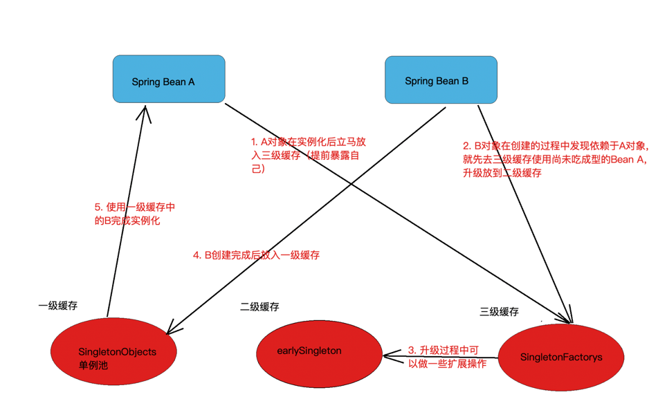

# Spring 
## Spring的循环依赖问题
1. Spring中循环依赖场景有：
    - 构造器的循环依赖（构造器注⼊）
    - Field 属性的循环依赖（set注⼊）
2. 各场景下循环依赖解决的情况
    - 单例 bean 构造器参数循环依赖（⽆法解决）\
      构造器在Bean的生命周期中实例化Bean的时候是需要载入参数的，而解决循环依赖时放入三级缓存中提前暴露出来的Bean对象时没有设置属性值的，所以这里构造器循环依赖不能处理。
    - prototype 原型 bean循环依赖（⽆法解决）\
      对于原型bean的初始化过程中不论是通过构造器参数循环依赖还是通过setXxx⽅法产⽣循环依赖，Spring都会直接报错处理。
    - 单例bean通过setXxx或者@Autowired进⾏循环依赖（可以解决）\
      单例bean构造器的循环依赖问题⽆法解决，只能拋出 BeanCurrentlyInCreationException 异常，在解决属性循环依赖时，spring采⽤的是提前暴露对象的⽅法。
3. Spring循环依赖处理流程\
   Spring循环依赖的理论依据是基于java的引用传递，当获得对象的引用时对象的属性是可以延后设置的，但是构造器必须在获取引用之前。Spring通过setXxx
或者@Autowired方法解决循环依赖，其实是通过提前暴露出来一个ObjectFactory对象来完成的。简单来说ClassA在调用构造器完成对象初始化之后，在调用ClassA的setClassB方法之前就把ClassA实例化的对象通过ObjectFactory提前暴露在Spring容器中。
    - Spring容器初始化A对象后，将实例化后的classA对象立马放入三级缓存提前暴露在Spring容器中；
    - classA调用setClassB方法，Spring首先尝试从容器中获取ClassB，此时ClassB不存在Spring容器中；Spring容器初始化ClassB，B在创建的时候
发现依赖于ClassA，那么去三级缓存中查找尚未成型的ClassA，并将其放入到二级缓存。放入二级缓存的时候可以做一些扩展操作。然后将ClassA返回，将ClassA赋值给ClassB的属性。
    - 此时ClassB就装配完成，将ClassB 的对象放入一级缓存。
    - ClassA从一级缓存中获取到ClassB的对象完成装配，完成初始化操作。此时循环依赖问题得到解决。
