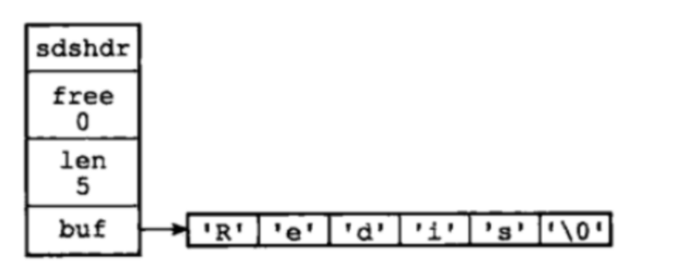

# Redis
redis在系统架构中的位置如图

## Redis底层数据结构
### 字符串对象

1. 字符串对象的实现
    - C语言字符数组："\0"
    - redis使用SDS（Simple Dynamic String），用于存储字符串和整形数据；
    - len：记录buf数组中已使用的字节数量；
    - free：记录buf数组中未使用的字节数量；
    - buf[]：字符数组，用于保存字符串；buf[]长度 = len + free + 1；
2. SDS的优势
    - SDS 在C字符串基础上加入了free和len 字段。获取字符串长度：SDS是O(1)；C字符串是O(n)；buf[]长度 = len + free + 1
    - SDS由于记录了长度，在可能造成缓冲区溢出时会自动重新分配内存，杜绝了缓冲区溢出；
    - 可以存取二进制数据，以字符串长度len来作为结束标识；
3. SDS使用场景
    - 存储字符串和整型数据、存储key、AOF 缓冲区和用户缓冲

### 跳表 - skiplist
- 跳表是sort set的实现；
- 跳表的基本思想：将有序链表中的部分节点分层，每一层都是一个有序链表；
- 查找次数接近于层数，接近于查找值下标的二分之一；
- 底层包含所有元素；
- 空间复杂度为O(n)，存储空间扩大了一倍；

### 字典 - dict
1. redis字典简述
    - 字典又称散列表，是用来存储键值对的一种数据结构；
    - redis整个数据库是用字典来存储的（K-V结构）；
    - **redis用来存储数据的容器是数组，采用头指针+偏移量的方式能够以O(1)的时间复杂度定位到数据所在的内存地址。这是redis进行海量数据存储速度快的一个原因；**
    - redis字典实现包括：字典（dict）、hash表（dictht）、hash表节点（dictEntry）;
    - dict里面有两个dictht，一个是原始hash表，一个是扩容hash表，；
    - dictht里面有多个数组dictEntry；
    - dictEntry里面存存着key、value和一个单向链表，单向链表用来解决hash冲突。
    1. 字典扩容 - rehash
        - 初次申请默认容量为4个dictEntry，非初次申请为当前hash表的容量的一倍；
        - rehashidx = 0表示要进行rehash操作；
        - 新增加的操作在新hash表h1中；
        - rehash过程中，修改、删除、查询在老hash表h0或新hash表h1中，需要遍历确定；
        - 将老hash表 h0的数据重新计算索引值后全部迁移到新的hash表h1中。
2. 渐进式rehash
   当数据量巨大的时候，rehash过程是非常缓慢的
    1. 服务器忙，只对一个节点进行rehash；
    2. 服务器闲可批量rehash（100个）；
3. 应用场景
    - 主数据库K-V数据存储；
        - 散列表对象：hash；
        - 哨兵模式中的主从节点管理；

### 快速列表 - quicklist
- 快速列表是列表的底层实现。redis在3.2之前采用双向链表（adlist）和压缩列表（ziplist）实现，在3.2以后结合adlist和ziplist的优势redis设计出了quicklist；
- quicklist是一个双向链表，链表中每一个节点是一个ziplist结构。quicklist中的每个节点ziplist都能够存储多个数据元素。这种结构优势在于节省存储空间。
为了进一步降低ziplist的存储空间，还可以对ziplist进行压缩，Redis采用的压缩算法是LZF。其基本思想是：与前面重复的数据记录重复的位置及长度，不重复的记录原始数据。
- quicklist应用在redis list的底层实现、发布与订阅、慢查询、监视器等功能。

### Redis的10种encoding
- String的编码
    - int：REDIS_ENCODING_INT - int类型的整数;
    - raw：REDIS_ENCODING_RAW - 简单动态字符串，大字符串 - 长度大于44个字节
    - embstr：REDIS_ENCODING_EMBSTR - 编码的简单动态字符串；
- list的编码：
    - quicklist：REDIS_ENCODING_QUICKLIST - 快速列表；
- hash的编码：
    - dict：REDIS_ENCODING_HT - 字典，当散列表元素的个数比较多或元素不是小整数或短字符串时；
    - ziplist：REDIS_ENCODING_ZIPLIST - 压缩列表，当散列表元素的个数比较少，且元素都是小整数或短字符串时；
- set的编码：
    - intset：REDIS_ENCODING_INTSET - 整型集合，当Redis集合类型的元素都是整数并且都处在64位有符号整数范围内（<18446744073709551616）；
    - dict：REDIS_ENCODING_HT - 字典，当Redis集合类型的元素都是整数并且都处在64位有符号整数范围外（>18446744073709551616）；
- zset的编码：
    - ziplist：REDIS_ENCODING_ZIPLIST - 压缩列表，当元素的个数比较少，且元素都是小整数或短字符串时；
    - skiplist + dict：跳跃表+字典，当元素的个数比较多或元素不是小整数或短字符串时。

## 缓存过期与淘汰策略
1. maxmemory
    1. 不设置maxmemory的场景
        - Redis的key 是固定的，不会增加；
        - Redis作为DB 使用，保证数据的完整性，不能淘汰。如果单机不够用可以做集群，水平扩展；
        - 缓存淘汰策略为默认时，即no-enviction - 禁止驱逐；
    2. 设置maxmemory的场景 \
       Redis达到最大物理内存后，性能急剧下降甚至崩溃。此时内存与硬盘不断交换虚拟内存，频繁IO使得内存急剧下降。
        1. redis作为缓存使用时，key不断增加；
        2. maxmemory默认是0，不限制最大使用内存；
    3. 具体设置多少 \
       具体的设置值与业务相关；
        1. 1个redis实例时，除了保证redis系统运行的1G外，剩下的全都可以设置Redis；
        2. 一般建议设置物理内存的3/4；
        3. 作为slave时，需要留出一定的内存；
    ```properties
    #在redis.conf中设置maxmemory
    maxmemory 1024mb
    # 获取maxmemory值的命令
    CONFIG GET maxmemory
    #设置maxmemory后，当趋近maxmemory时，通过缓存淘汰策略，从内存中删除对象；
    # 设置maxmemory后maxmemory-policy要配置
    # 不设置maxmemory则无最大内存限制，maxmemory-policy默认为no-enviction(禁止驱逐)
    ```
2. 删除策略 \
   Redis的数据删除有定时删除、惰性删除和主动删除三种方式；目前采用惰性删除和主动删除的方式。
    - 定时删除
        - 在设置键的过期时间的同时，创建一个定时器。让定时器在键的过期时间来临时，立即执行对键的删除操作；
        - 需要创建定时器，而且消耗CPU。一般不推荐使用；
    - 惰性删除
        - 在key 被访问时，如果发现它已经失效，那么就删除它；
        - 调用expireIfNeeded函数。该函数的意义是：读取数据之前先检查它有没有失效，如果失效了就删除它。
    - 主动删除
        - 在redis.conf文件中可以配置主动删除策略，默认是no-enviction；
3. 主动删除淘汰策略
    - LRU \
      Least Recently Used - 最近最少使用，算法根据数据的历史访问记录，来进行淘汰数据。其核心思想是：“如果数据最近被访问过，那么将来被访问的几率也更高”；
        - 使用链表实现LRU的思想
            - 新数据插入链表头部；
            - 每当缓存命中，则将数据移到链表头部；
            - 当链表满的时候，将链表尾部的数据丢弃；
            - 在Java中可以使用LinkedHashMap去实现链表；
        - LRU的数据淘汰机制
            - 在数据集中随机挑选一部分键值对，取出其中LRU最大的键值对淘汰；
            - 不会遍历所有key的，代价太大。当前时间呢 - 最近访问时间的值越大，说明访问的间隔时间越长；
        - LRU分类
            - volatile-lru：从已设置过期时间的数据集中挑选最近最少使用的数据淘汰；
            - allkeys-lru：从全部数据集中挑选最近最少使用的数据淘汰；
    - LFU \
      Least frequently used - 最近使用频率最少的。如果一个数据在最近一段时间内使用次数很少，那么在将来的一段时间内被使用的可能性也很小；
        - volatile-lfu：从已设置过期时间的数据集中挑选最近使用频率最少的数据淘汰；
        - allkeys-lfu：从全部数据集中挑选最近使用频率最少的数据淘汰；
    - Random
        - volatile-random：从已设置过期时间的数据集中随机选择数据淘汰；
        - allkeys-random：从全部数据集中随机选择数据淘汰；
    - ttl
        - volatile-ttl：从已设置过期时间的数据集中选择将要过期的数据淘汰；
        - TTL数据淘汰机制：从过期时间的表中随机挑选几个键值对，取出其中ttl最小的淘汰；
    - no-enviction \
      禁止驱逐数据，即不删除数据。redis默认的淘汰策略。
4. 缓存淘汰策略的选择
    - allkeys-lru：在不确定时一般采用的策略，用于冷热数据交换；
    - volatile-lru：比allkeys-lru性能差，需要存过期时间；
    - allkeys-random：希望请求符合平均分布。每个元素以相同的概率被访问；
    - 自己控制：volatile-ttl，容易出现缓存穿透；

## Redis持久化
- 为什么Redis要持久化？
    - Redis是内存数据库，宕机后数据会消失；
    - Redis重启后快速恢复数据，要提供持久化机制；
    - Redis持久化是为了快速恢复数据，而不是为了快速存储数据；
- 注意：
    - Redis 持久化不保证数据的完整性。当Redis用作DB时DB数据要完整，必须要有一个完整的数据源（文件或MySQL）。
    - 在系统启动的时候，从这个完整的数据源中将数据load到Redis中。
### RDB
Redis DataBase是redis默认的存储方式，RDB是通过快照（snapshotting）完成的。
1. RDB 快照的触发方式
    - 符合自定义配置的快照规则；
    - 执行save或者bgsave命令；
    - 执行flushall命令；
    - 执行主从复制操作（第一次）；
    - 配置参数定期执行RDB
        ```properties
            # 在redis.conf中配置：save seconds change
            save "" # 不使用RDB存储 不能主从 
            save 900 1 # 表示15分钟（900秒钟）内至少1个键被更改则进行快照。 
            save 300 10 # 表示5分钟（300秒）内至少10个键被更改则进行快照。 
            save 60 10000 # 表示1分钟内至少10000个键被更改则进行快照。
        ```
2. RDB 执行原理
    1. Redis父进程首先判断：当前是否在执行save，bgsave或bgrewriteaof的子进程。如果在执行则bgsave命令直接返回；
    2. 父进程执行fork（调用OS函数复制主进程）操作创建子进程。这个复制过程中父进程是阻塞的，Redis不能执行来自客户端的任何命令；
    3. 父进程fork后，bgsave命令返回“Background saving started”信息，并不再阻塞父进程，并可以响应其他命令；
    4. 子进程创建RDB文件，根据父进程内存快照生成临时快照文件，完成后对原有快照文件进行原子替换（RDB始终完整）；
    5. 子进程发送信号给父进程表示完成，父进程更新统计信息；
    6. 父进程fork子进程后，继续工作。

3. RDB的优缺点
    - 优点
        - RDB是二进制压缩文件，占用空间小，便于传输（传给slaver）；
        - 主进程fork子进程，可以最大化redis的性能；
    - 缺点
        - 主进程不能太大，Redis数据量也不能太大，复制过程中主进程阻塞；
        - 不保证数据完整性，会丢失最后一次快照以后更改的所有数据；

### AOF
append only file 是redis的一种持久化方式，默认情况下不开启。开启后，Redis将所有对数据库进行过写入的命令及其参数（RESP）记录到AOF文件，以此
达到记录数据库状态的目的。当Redis重启后只要按顺序回放这些命令去恢复到原始状态了。AOF会记录过程，RDB只关注结果。
1. 配置AOF持久化
```properties
    # 可以通过修改redis.conf配置文件中的appendonly参数开启 
    appendonly yes 

    # AOF文件的保存位置和RDB文件的位置相同，都是通过dir参数设置的。 
    dir ./ 

    # 默认的文件名是appendonly.aof，可以通过appendfilename参数修改 
    appendfilename appendonly.aof
```
2. AOF 原理
    - AOF存储的是redis命令，同步命令到AOF文件的整个过程分为三个阶段：
    - 命令传播 \
      Redis执行完的命令、命令的参数、命令的参数个数等信息发送到AOF程序中。当一个Redis客户端需要执行命令时，他通过网络连接，将协议文本发送给Redis服务器。服务器在接到客户端的请求后，会根据协议文本的内容选择适当的命令函数，并将各个参数从字符串文本转换为Redis字符串对象（StringObject）。每当命令函数成功执行之后，命令参数都会被传播到AOF程序。
    - 缓存追加 \
      AOF程序根据接收到的命令数据，将命令转换成网络通讯协议的格式，然后将协议内容追加到服务器的AOF缓存中；当命令传播到AOF程序之后，程序会根据命令以及命令的参数，将命令从字符串对象转变为原来的协议文本。协议文本生成之后，它会被追加到redis.h/redisServer结构的aof_buf末尾。redisServer结构维持着Redis服务器的状态，aof_buf域则保存着所有等待写入到AOF文件的协议文本（RESP）。
    - 文件写入和保存 \
      AOF缓存的内容被写入到AOF文件的末尾，如果设定的AOF保存条件被满足的话，fsync函数或者fdatasync函数会被调用，将写入的内容保存到磁盘中；每当服务器常规任务函数被执行，或事件处理器被执行时，aof.c/flushAppendOnlyFile函数都会被调用，这个函数执行以下两个工作：
    - Write：根据条件将aof_buf中的缓存写入到AOF文件；
    - Save：根据条件调用fsync或fdatasync函数，将AOF文件保存到磁盘中；
3. AOF 保存模式
    - AOF_FSYNC_NO：不保存 \
      在这种模式下，每次调用flushAppendOnlyFile函数，write都会被执行，但save会被略过。 \
      在这种模式下，save只会在以下三种种情况中被执行：
        - Redis被关闭；
        - AOF功能被关闭；
        - 系统写缓存被刷新（是缓存已经被写满或者定期保存操作被执行）；
    - AOF_FSYNC_EVERYSEC：每秒钟保存一次（默认）\
      在这种模式下，save原则上每隔一秒钟就会执行一次。因为save操作是由后台子线程（fork）调用的，所以他不会引起主进程阻塞；
    - AOF_FSYNC_ALWAYS：每执行一个命令保存一次（不推荐）\
      在这种模式下，每次执行完一个命令后，write和save都会被执行。因为save是由redis主进程执行的，所以在save执行期间，主进程会被阻塞，不能接受命令请求；

  | 模式               | write是否阻塞 | save是否阻塞 | 停机时丢失的数据量                              |
  | ------------------ | ------------- | ------------ | ----------------------------------------------- |
  | AOF_FSYNC_NO       | 阻塞          | 阻塞         | 操作系统最后一次对AOF文件触发save操作之后的数据 |
  | AOP_FSYNC_EVERYSEC | 阻塞          | 不阻塞       | 一般情况下不超过2秒钟的数据                     |
  | AOP_FSYNC_ALWAYS   | 阻塞          | 阻塞         | 最多只丢失一个命令的数据                        |

### Redis混合持久化

```properties
    # 在redis.conf中开启混合持久化
    aof-use-rdb-preamble yes
```
Redis4.0开始支持rdb和aof的混合持久化，aof 在rewrite的时候会直接把rdb的内容写到aof文件的开头。所以持久化文件appendonly.aof == RDB的头 + AOF的身体。加载持久化文件时会先识别AOF文件是否以redis字符串开头，如果是就先按RDB格式加载，加载完RDB 后继续按AOF格式加载剩余部分。AOF文件的载入和数据还原
- 创建一个不带网络连接的伪客户端。因为Redis命令只能在客户端上下文中执行，而载入AOF文件时所使用的命令直接来源于AOF文件而不是网络连接。所以服务器使用了一个没有网络连接的伪客户端来执行AOF文件保存的写命令，伪客户端执行命令的效果和带网络连接的客户端执行命令的效果完全一样；
- 从AOF文件中分析并读取出一条写命令；
- 使用伪客户端执行被读出的写命令；
- 重复执行步骤2 和步骤3，直到AOF 文件中的所有写命令都被处理完毕为止；


### RDB和AOF的区别
- rdb存某个时刻的数据快照，采用二进制压缩；aof存储操作命令，采用文本存储；
- rdb性能高，aof性能低；
- rdb在配置触发状态会丢失最后一次快照以后更改的所有数据；aof设置每秒保存一次，则最多丢两秒数据；
- Redis以主服务器模式运行，rdb不会保存过期键值对数据；redis以从服务器模式运行，rdb会保存过期键值对，当主服务器向从服务器同步时，再清空过期键值对；
- aof写入文件时，对过期的key 会追加一条del 命令，当执行aof重写时，会忽略过期key 和del命令。

### RDB和AOF的应用场景
1. 选型
    - 用做内存数据库时，rdb和aof都开，这样数据不容易丢失；
    - 有原始数据源，且数据量比较小，则不用开启持久化。每次启动时都从原始数据源中初始化数据；
    - 用做缓存服务器，一般开启RDB，因为RDB性能高；
2. 数据还原时文件选择
    - rdb和aof文件都存在时，则还原aof，因为rdb会造成文件丢失，aof 相对数据要完整；

## Redis高可用
- 主从复制 + 哨兵模式
- codis集群
- redisCluster
### 主从复制
1. 主从复制开启 \
   主从复制分为一主一从、一主多从和一主多从的传递复制。主可写，从不可写；主挂了，从不可为主。
    - 主服务器无需配置
    - 从服务器修改redis.conf文件，设置replicaof
        ```properties
            # slaveof <masterip> <masterport> # 表示当前【从服务器】对应的【主服务器】的IP是192.168.10.135，端口是6379。 replicaof 127.0.0.1 6379
        ```
2. 主从复制作用
    1. 读写分离
        - 一主多从，主从同步，主负责写，从负责读；
        - 提升redis的性能和吞吐量；
        - 会出现主从数据一致性问题
    2. 数据容灾
        - 从机是主机的备份，主机宕机，从机可读不可写。默认情况下主机宕机，从机不可升级为主机；
        - 可以利用哨兵实现主从切换实现高可用；
3. 主从复制原理
    1. 主从复制流程
        - 保存主节点信息 \
          客户端向从服务器发送replicaof配置的主机地址+端口时，从服务器将主机IP和端口保存到redisServer的masterhost和masterport中；\
          从服务器向发送replicaof命令的客户端返回OK。表示复制指令已被接收，而实际复制工作是在OK返回后进行的。
        - 建立socket连接 \
          slave和master建立socket连接。slave关联文件事件处理器，该处理器接收RDB文件（全量复制），接收master传过来的写命令（增量复制）。主服务器accept从服务器的Socket连接后，创建相应的客户端状态，相当于从服务器是主服务器的Client端。
        - 发送ping命令
            - Slave向Master发送ping命令
                - 检测socket的读写状态；
                - 检测master能否正常处理；
            - Master向Slave响应
                - 响应pong命令，说明正常；
                - 返回错误说明master不正常；
                - 返回timeout说明网络超时；
        - 权限认证 \
          主从正常连接后，进行权限验证。检查是否需要密码；
        - 发送端口信息 \
          权限验证通过后，从服务器执行命令: REPLCONF listening-port，向主服务器发送从服务器的监听端口号；
        - 同步数据 \
          全量或增量同步数据；
        - 命令传播 \
          当同步数据完成之后，主从服务器就进入命令传播阶段。主服务器只要将自己执行的写命令发送给从服务器，而从服务器只要一直接收并执行主服务器发来的写指令。
    2. 主从数据同步 - 2.8之后 \
       在Redis2.8之后使用psync命令，具备完整重同步和部分重同步模式。redis的主从同步分为全量同步和增量同步。从机第一次连上主机时是全量同步；断线重连有可能触发全量同步也有可能触发增量同步（master判断runid是否一致）。除此之外的情况都是增量同步。
        - 全量同步过程 
            - 同步快照阶段：master 创建并发送快照给slave，slave载入并解析快照。master同时将此阶段所产生的新的写命令存储到缓冲区；
            - 同步写缓冲阶段：master向slave同步存储在缓冲区的写命令；
            - 同步增量阶段：master向slave同步写命令
        - 增量同步过程
            - Redis增量同步主要指Slave完成初始化后开始正常工作时，master发生的写操作同步到slave的过程；
            - 通常情况下，master每执行一个写命令就会向slave发送相同的写命令，然后slave接收并执行。
4. 心跳检测 \
   在命令传播阶段，从服务器会默认以每秒一次的频率向主服务器发送命令。
    - 检测主从的连接状态，主从之间是否有连接故障；
    - 辅助实现min-slaves，保证主从复制是在安全的情况下执行的；
    - 检测命令丢失，网络故障导致主从复制时从服务器接收的命令半路丢失，会通过检测手段发现，并在积压缓冲区找到缺少的数据，重新发送。
### 哨兵模式
1. 哨兵模式执行流程
    1. 启动并初始化Sentinel。Sentinel实例启动后，每个Sentinel会创建2个连向主服务器的网络连接。
        - 命令连接：用于向主服务器发送命令，并接收响应；
        - 订阅连接：用于订阅主服务器的—Sentinel—:hello频道。
    2. 获取主服务器信息。Sentinel默认每10秒向被监控的主服务器发送info命令，获取主服务器和其下属从服务器的信息；
    3. 获取从服务器的信息。当Sentinel发现主服务器有新的从服务器出现时，Sentinel还会向从服务器建立命令连接和订阅连接。命令连接建立后，Sentinel还会默认10秒一次向从服务器发送info命令，并记录从服务器信息；
    4. 向主服务器和从服务器发送订阅消息。默认情况下，Sentinel每2秒一次向所有被监视的主服务器和从服务器所订阅的—Sentinel—:hello频道上发送消息，消息中会携带Sentinel自身的信息和主服务器的信息；
    5. 接收来自主服务器和从服务器的频道信息。当Sentinel和主服务器和从服务器建立起订阅连接后，Sentinel就会通过订阅连接向服务器发送以下命令。sentinel彼此之间只创建命令连接而不创建订阅连接。因为Sentinel通过订阅主服务器或从服务器就可以感知到新的Sentinel的加入。而一旦新的Sentinel加入后，相互感知的Sentinel通过命令来创建命令连接就可以了；
        ```shell
        subscribe —sentinel—:hello
        ```
    6. 检测主观下线状态
        - Sentinel每秒一次向与他建立命令连接的实例（主服务器、从服务器和其他Sentinel服务器）发送PING命令；
            - 实例在down-after-millseconds毫秒内返回无效回复；（除+PONG、- LOADING、- MASTERDOWN外）；
            - 实例在down-after-millseconds毫秒内无回复（超时）；
        - Sentinel就会认为该实例主观下线（**DOWN**）；
    7. 检查客观下线状态。当一个Sentinel将一个主服务器判断为主观下线后，Sentinel会同时监控这个主服务器的所有其他Sentinel发送查询命令，判断他们是否也认为主服务器下线。如果达到Sentinel配置中的quorum数量的Sentinel实例都判断主服务器为主观下线，则该主服务器就会判断为客观下线；
    8. 选举leader Sentinel。当一个主服务器判定为客观下线后，监视这个主服务器的所有Sentinel会通过选举算法（raft），选出一个Leader Sentinel去执行failover（故障转移）操作；
2. Sentinel的leader选举流程
    - 某Sentinel认定master客观下线后，该Sentinel会先看看自己有没有投过票，如果自己已经投过票给其他Sentinel 了，在一定是时间内自己就不会成为leader；如果该Sentinel 还没投过票，那么他就会成为Candidate；
    - Sentinel需要完成几件事：
        - 更新故障转移状态为start；
        - 当前epoch + 1，想当于进入了一个新的term；
        - 向其他节点发送`is-master-down-by-addr`命令请求投票，命令会带上自己的epoch；
        - 给自己投一票（leader、leader_epoch）；
    - 当其他哨兵收到`is-master-down-by-addr`命令时，可以同意或者拒绝它成为领导者；（通过判断epoch）
    - Candidate 会不断的统计自己的票数，直到他的票数超过Sentinel数量的一半并且超过他配置的quorum时，它就成为了leader；
    - 其他Sentinel等待Leader从slave选出master并检测到新的master正常工作后，就会去掉客观下线的标识。
3. 哨兵模式的故障转移
    - Leader Sentinel将失效master的其中一个slave升级为新的master，并让其他slave改为复制新的master；
    - 当客户端试图连接失效的master时，集群也会向客户端返回新master的地址，使得集群也能用新的master替换失效的master；
    - master和slave的服务器切换后，master的redis.conf、slave的redis.conf和sentinel的redis.conf的配置文件内容都会发生相应的变化。即：master主服务器的redis.conf配置文件会多一行`replicaof`的配置，sentinel.conf的监控目标也会随之调换；
4. 主服务器master的选择原则
    1. 哨兵Leader过滤掉主观下线的节点；
    2. 选择`slave-priority`最高的节点。如果有则返回，没有就继续选择；
    3. 选择出复制偏移量最大的节点。因为复制偏移量愈大则数据复制愈完整。如果有就选择，没有就继续选择；
    4. 选择`run_id`最小的节点，因为他越小说明它重启的次数越少；

## Raft协议介绍
raft协议是用来解决分布式系统一致性的问题的协议。raft协议描述的节点共有三种状态：Leader、Follower、Candidate。raft协议将时间分为一个个的term（任期 - 一种逻辑时间）。
1. leader选举流程
    - raft采用心跳机制触发leader选举。系统启动后，全部节点初始化为Follower且term为0；
    - 节点如果收到了RequestVote或AppendEntries，就会保持自己的follower身份；
    - 节点如果一段时间内没收到AppendEntries消息，在该节点的超时时间内还没发现leader，follower就会转换成Candidate自己开始竞选leader。该结点转换为Candidate后立即开始做下面几件事情：
        - 增加自己的term；
        - 启动一个新的定时器；
        - 给自己投一票；
        - 向所有其他节点发送RequestVote，等待其他节点回复；
    - 如果在计时器超时前，该节点收到多数节点的同意票就转为leader。同时向其他节点发送AppendEntries，告知自己成了leader。
    - 每个节点在一个term内只能投一票，采取先到先得的策略。Candidate前面已经投给了自己。Follower会投给收到第一个RequestVote信息的Candidate节点。 \
      raft协议的定时器采取**随机超时时间**的机制，这是选举leader的关键。在同一个term周期内，先转为Candidate的节点会先发起投票，从而获得多数票。

### 集群与分区
1. 什么是分区
   分区是将数据分布在多个redis实例上，以至于每个实例只包含一部分数据；
2. 为什么要分区
    - 高可用 - 集群的故障转移
    - 高性能 - 多台计算能力；读写分离
    - 高扩展 - 横向主机扩展（优于主从和哨兵的地方）
3. 分区的方式 \
   根据分区键（ID）进行分区
    - 范围分区：根据ID数字的范围1—10000、10001—20000 ······，每个范围分到每个不同的redis实例中；
        - 优点
            - 实现简单，方便迁移和扩展；
        - 缺点
            - 热点数据分布不均，性能损失严重；
            - 非数字型key无法处理 ，比如UUID的使用（可用雪花算法替代）
    - hash分区：利用简单的hash算法即可
        - 优点
            - 支持任何类型的key；
            - 热点分布较均匀，性能较好；
        - 缺点
            - 迁移复杂，需要重新计算，扩展性较差（可用一致性hash环解决）。
4. Client端分区 \
   对于一个给定的key，客户端直接选择正确的节点进行读写。许多Redis客户端（JedisPool）都实现了客户端分区，也可以自行编程实现；
    - 客户端选择算法
        1. 普通hash \
           hash算法可采用hashCode或hash算法CRC32、CRC16等；
            - 普通hash的优点
                - 实现简单、热点数据分布均匀
            - 普通hash的缺点
                - 节点数固定，扩展的话需要重新计算；
                - 查询时必须用分片的的key来查，一旦key改变，数据就查不出。所以要使用不易改变的key进行分片；
        2. 一致性hash
            - 原理
                - 我们把2^32看成一个圆；
                - 取服务器IP的hash值，对2^32 求模。结果就对应圆上一个点；`hash（服务器的IP地址）% 2^32`
                - 我们取Redis的key的hash值，并对2^32求模。结果也落到这个圆上；`hash（key）% 2^32`
                - 该数据沿圆周顺时针方向遇到的第一个服务器就是该数据落地的服务器；
                - 由于被缓存的数据key和服务器ip地址hash后的值是固定的。在服务器地址不变的情况下，数据必然缓存到固定的服务器上。当下次想要访问数据的时候，只要再次使用相同的算法计算，即可算出这个数据被缓存在了哪个服务器上，直接去对应的服务器查找对应的数据即可。
            - 一致性hash的优点 \
              添加或移除节点时，数据只需要做部分迁移
            - hash环偏移
                - hash环偏移概念：一致性hash算法下会使数据分配不均匀，从而导致服务器性能不平均。这种现象称为hash环偏移；
                - 解决方案：给实际服务器增加虚拟服务器节点
            - hash环偏移结决方案的缺点
                - 复杂度高 \
                  客户端需要自己处理数据路由、高可用、故障转移等问题；使用分区，数据的处理会变的复杂。不得不对付多个redis数据库和AOF文件，不得不在多个实例和主机之间持久化你的数据；
                - 不易扩展 \
                  一旦节点的增或者删操作，都会导致key无法在redis 中命中，必须重新根据节点计算，并手动迁移全部或部分数据。
5. Proxy端分区 \
   在客户端和服务端引入一个代理或代理集群，客户端将命令发送到代理上。由代理根据算法，将命令路由到相应的服务器上。常见的代理有Codis(豌豆荚)和TwemProxy(Twitter)。
6. Redis的Cluster分区
    1. 相关概念 \
       Redis3.0之后官方提供了完整的集群解决方案。方案采用去中心化的方式，包括sharding(分区)、replication（分片）、failover（故障转移）。Redis5.0前需要ruby支持，Redis 5.0就可以直接使用Redis-cli进行集群的创建和管理。
        - 去中心化 \
          RedisCluster由多个Redis节点组成，是一个P2P无中心节点的集群架构，依靠Gossip协议传播的集群；
        - Gossip协议
            - Gossip是一个通信协议，一种传播消息的方式；
            - 基本思想是：一个节点周期性（每秒）随机选择一些节点，并把信息传递给这些节点。这些收到信息的节点接下来会做同样的事情，即把这些信息传递给其他一些随机选择的节点。信息会周期性的传递给N个目标节点，这个N被称为`fanout`（扇出）；
            - Gossip协议包含多种消息，包括meet、ping、pong、fail、publish 等。通过Gossip协议，cluster可以提供集群间状态同步信息、选举自助、failover等重要集群功能；

              | 命令    | 说明                                                         |
              | ------- | ------------------------------------------------------------ |
              | meet    | sender向receiver发出，请求receiver加入sender集群             |
              | ping    | 节点检测其他节点是否在线                                     |
              | pong    | receiver收到meet或ping后回复信息；在failover后，新的master也会广播pong; |
              | fail    | 节点A判断节点B下线后，A节点广播B的fail信息，其他收到此信息的节点会将B标记为下线 |
              | publish | 节点A收到publish命令后执行该命令，并向集群广播publish命令；收到publish命令的节点都会执行相同的publish命令。 |
            - slot：redis-cluster把所有的物理节点映射到【0—16383】个solt上，基本上采用平均分配和连续分配的方式。当需要在Redis集群中放置一个K-V时，redis先对key使用CRC16算法算出一个结果，案后在对16384取余，结果会落到0—16383之间的槽上，redis会根据节点数量大致均等的将hash槽映射到不同的节点。`CRC16(key)%16384`
            - solt槽必须在节点上连续分配，如果出现不连续的情况，则RedisCluster 不能工作。
        - RedisCluster的优势
            - 高性能：多主节点、负载均衡、读写分离；
            - 高可用：主从复制、failover、实现类raft的共识方式保证集群的可用性；
            - 易扩展：增减节点不需要停机，数据分区；
            - 原生：RedisCluster不需要其他代理，Redis Cluster和单机Redis完全兼容
7. 分片
   1. moved重定向
        - 每个节点都会通过通信共享Redis Cluster槽和集群中对应节点的关系；
        - 客户端向任意Redis Cluster发送命令，接收命令的节点会根据CRC16规则进行hash运算并和16384取余，计算出自己的槽节点；
        - 如果保存数据的槽分配在Redis Cluster的当前节点，则去槽中执行命令，并把命令结果返回给客户端；
        - 如果保存数据的槽没有分配在Redis Cluster的当前节点，则向客户端返回moved重定向异常，异常中带有目标节点的信息；
        - 客户端接受到节点返回的结果，如果是moved异常，则从异常中获取目标节点的信息；
        - 客户端向目标节点发送命令，获取命令执行结果；

   2. ask重定向
       - 客户端向目标节点发送命令，若此时正在进行集群扩容或缩容操作，槽及槽中的数据已经被迁移到别的节点。此时目标节点就会带着目标节点信息ask重定向给客户端；
       - 客户端向新的节点发送asking命令，并再次向新的节点发送命令；
       - 新的节点执行命令，把命令执行结果返回给客户端；

8. 容灾
   1. 故障检测
       - 集群中每一个节点都会定期的（每秒）向集群中的其他节点发送PING消息；
       - 如果在一定时间内（cluster-node-timeout），发送ping节点的节点A没有收到节点B的pong回应，则A将B标识为pfail；
       - A在后续发送ping时会带上B的pfail信息，通知给其他节点；
       - 如果标记节点B为pfail的个数大于或等于集群主节点的一半时（N/2+1），B会标记为fail并向整个集群广播该节点已下线；
       - 其他节点收到广播标记B为已下线；
   2. 从节点选举
       - 采用raft协议，每个从节点都根据自己对master复制数据的offset，来设置一个选举时间，offset越大（复制数据越多）的从节点，选举时间越靠前，优先进行选举；
       - slave通过向其他master发送FAILOVER_AUTH_REQUEST消息发起竞选。发送前会将currentEpoch自增，并将最新的epoch带入到request消息中；
       - 其他master收到后回复FAILOVER_AUTH_ACK消息告知是否同意。如果自己未投过票则回复同意，否则回复拒绝；
       - 如果大部分master都投票给某一个从节点（N/2+1），那么选举通过，通过的从节点切换成master；
   3. RedisCluster失效的判定
       -  集群中半数以上的节点都宕机（无法投票）；
       -  宕机的主节点的从节点也宕机（slot槽分布不连续）；
   4. 变更通知 \
      当slave收到过半的master同意时，会成为新的master。此时会以最新的Epoch通过PONG消息广播自己成为master，让Cluster的其他节点尽快更新拓扑结构（node.conf）；
   5. 主从切换
       1. 自动切换：即从节点的切换
       2. 主动切换 \
          人工故障切换时预期切换，而非真正发生了故障。目的是以一种安全的方式（数据无丢失）将当前master节点和其中一个slave节点（执行cluster-failover的节点）交换角色。
           - 向从节点发送cluster failover命令（slaveof no one）；
           - 从节点告知其主节点要进行手动切换（CLUSTERMSG_TYPE_MFSTART）；
           - 主节点会阻塞所有客户端命令的执行（10S）；
           - 在从节点的ping包中获的主节点的复制偏移量；
           - 从节点的复制达到偏移量，发起选举、统计投票、赢得票选、升级为主节点并更新配置；
           - 切换完成后，原主节点向所有客户端发送moved指令重新定义到新的主节点；
           - **以上是主节点在线的情况下**
           - 如果主节点下线了，则采用cluster failover force或cluster failover takeover 进行强制切换；
   6. 副本漂移 \
      一主一从时主从同时挂了，整个集群就挂了；一主多从成本会增加；redis的副本漂移既能提高集群的可靠性又不用增加太多的从机 \
      若master1宕机，则slave11会提升为新的Master1。当集群检测到新的master1是单点无从机时，集群从拥有最多从机的节点组（master3）中选择节点
名称字母顺序最小的从机（slave31）漂移到单点的主从节点组上。（master1）\
      具体流程如下：
       - 将slave31的记录从master3中删除；
       - 将slave31的主机改为master1；
       - 在master1中添加slave31为从节点；
       - 将slave31的复制源改为master1；
       - 通过ping包将信息同步到集群的其他节点。


## Redis经典问题
### 缓存的选取
1. JVM缓存 \
   JVM缓存就是本地缓存，设计在应用服务器中（Tomcat）。通常采用EhCache或Guava Cache。在互联网应用中，由于要处理高并发，通常选择Guava Cache。\
   适用场景：
    - 对性能有非常高的要求；
    - 不经常变化的数据；
    - 占用内存不大的数据；
    - 有访问整个集合的需求；
    - 数据不允许强一致的场合；
2. 文件缓存 \
   一般是基于http协议的缓存，放在nginx中；
3. Redis缓存 \
   一般做分布式缓存，采用主从+哨兵或Redis Cluster的方式缓存数据库数据；
    - 如果做缓存数据库使用，数据要完整；
    - 可以做缓存使用，也可以做Mybatis的二级缓存使用；
4. 缓存大小 \
   缓存大小可以通过配置文件设置
5. 缓存淘汰策略的选择
    1. allkeys-lru：在不确定时一般采用此方式；
    2. volatile-lru：要比allkeys-lru性能差，因为要存过期时间；
    3. allkeys-random：希望请求符合平均分布（每个元素以相同的概率被访问）；
    4. volatile-ttl：自己控制，容易造成缓存穿透；
    5. no-enviction：禁止驱逐，用作DB，不设置maxmemory
6. key数量
    - Redis单实例可以处理2.5亿个key；
    - 一个key或value的大小是512兆；
7. 读写峰值 \
   Redis时基于内存的，采用单进程单线程模型的KV数据库，由C语言编写。可以达到11000的QPS（每秒查询数）和80000的写；
8. 命中率 \
   一个缓存失效机制和过期时间设计良好的系统，命中率可以做到95%以上；
    - 影响缓存命中率的因素：
        - 缓存的数量越少命中率越高，比如缓存单个对象的命中率要高于缓存集合；
        - 过期时间越长命中率越高；
        - 缓存越大、缓存的对象越多，则命中的越多；
    ```shell
    # 通过info命令查看缓存命中状态
    127.0.0.1:6379> info 
    # Server 
    redis_version:5.0.5 
    redis_git_sha1:00000000 
    redis_git_dirty:0 
    redis_build_id:e188a39ce7a16352 
    redis_mode:standalone 
    os:Linux 3.10.0-229.el7.x86_64 x86_64 
    arch_bits:64 
    #缓存命中 
    keyspace_hits:1000 
    #缓存未命中 
    keyspace_misses:20 
    used_memory:433264648 
    expired_keys:1333536 
    evicted_keys:1547380
    # 命中率=1000/1000+20=83%
    ```
9. 过期策略 \
   Redis的默认过期策略是定时删除 + 惰性删除
10. 性能监控指标 \
    Redis监控平台：grafana、prometheus以及redis_exporter。
    ```shell
    # 利用info命令就可以了解Redis的状态
    connected_clients:68 #连接的客户端数量 
    used_memory_rss_human:847.62M #系统给redis分配的内存 
    used_memory_peak_human:794.42M #内存使用的峰值大小 
    total_connections_received:619104 #服务器已接受的连接请求数量 
    instantaneous_ops_per_sec:1159 #服务器每秒钟执行的命令数量 
    qps instantaneous_input_kbps:55.85 #redis网络入口kps 
    instantaneous_output_kbps:3553.89 #redis网络出口kps 
    rejected_connections:0 #因为最大客户端数量限制而被拒绝的连接请求数量 
    expired_keys:0 #因为过期而被自动删除的数据库键数量 
    evicted_keys:0 #因为最大内存容量限制而被驱逐（evict）的键数量 
    keyspace_hits:0 #查找数据库键成功的次数 
    keyspace_misses:0 #查找数据库键失败的次数
    ```
11. 缓存预热 \
    缓存预热就是系统启动前，提前将相关的缓存数据直接加载到缓存系统。避免在用户请求的时候先查询数据库，然后再将数据缓存的问题。使得用户可以直接查询被预热的缓存数据。
    - 加载缓存思路
        - 数据量不大，可以在项目启动的时候自动进行加载；
        - 利用定时任务刷新缓存，将数据库的数据刷新到缓存中；

### 缓存问题
#### 缓存穿透
- 概念：指高并发下查询Key不存在的数据，会穿过缓存查询数据库，导致数据库压力过大而宕机。
- 解决方案
    - 对查询结果为空的数据也进行缓存，设置默认值，缓存时间（ttl）设置短一点，或者该key对应的数据insert了之后清理缓存。会出现缓存太多不存在值，占用更多空间；
    - 使用布隆过滤器。在缓存之前加一层布隆过滤器。查询的时候先去布隆过滤器查询key是否存在，如果不存在就直接返回，存在再查缓存和DB；
#### 缓存雪崩
- 概念：指缓存服务器重启或者大量的缓存集中在某一个时间点失效，给DB系统带来很大压力，导致数据库崩溃；
- 解决方案
    - 将key的是失效期分散开，不同的key设置不同的有效期；
    - 设计二级缓存，可能会导致数据不一致；
    - 设计高可用方案（可能会导致脏读的现象）；
#### 缓存击穿
- 指缓存在某个时间点过期，这时这个key恰好有大量的并发请求过来，会从DB加载数据并回写到缓存。这时候大并发可能会压垮缓存。
- 解决方案
    - 分布式锁控制访问的线程。使用redis的setnx互斥锁先进行判断，这样其他线程就处于等待状态，保证不会有大并发去操作数据库；
    - 不设置超时时间。但是采用volatile-lru会造成写一致的问题；当数据库发生更新时，缓存中的数据不会及时更新这样会造成数据库中数据和缓存中的数据不一致，应用会从缓存中读取到脏数据。可采用**延时双删策略**。
#### 高并发脏读的三种情况
- 先更新数据库再更新缓存：update和commit之间更新缓存，commit失败，则DB和缓存数据不一致；
- 先删除缓存再跟新数据库：update和commit之间有新的读，缓存为空，读DB数据到缓存，数据是旧数据，commit后是新数据，则DB和缓存数据不一致；
- 先更新数据库再删除缓存：update和commit之间有新的读，缓存为空，读DB数据回填到缓存，缓存数据依旧是旧数据，commit之后DB为新数据，则DB和缓存数据不一致；**采用延时双删策略**
#### 数据不一致
- 缓存和数据库不一致的根源是数据源不一样；
- 如何解决：强一致很难，追求最终一致性；
- 时序控制是否可行？先更新数据库再更新缓存或者先更新缓存再更新数据库本质上不是一个原子操作，所以时序控制不可行，高并发下会产生不一致。
- **延时双删**：保证最终一致性
    - 先删除缓存项然后更新数据库，等读的时候再填充缓存；
    - 2秒后再删除一次缓存；
    - 设置缓存过期时间Expired Time，比如10秒或1小时；
    - 将缓存删除失败的操作记录道日志中，利用脚本提取失败记录再次删除。 \
      升级方案：通过数据库的binlog 来异步淘汰key，利用工具canal将binlog日志采集发送到MQ中，然后通过ACK机制确认处理删除缓存。
#### 数据不一致的处理为什么是删除缓存而不是更新缓存
- 缓存的值是一个结构，hash、list更新时需要先遍历缓存再更新。遍历很耗时；
- 删除缓存可以使用懒加载的模式，只有到了使用的时候才从DB加载，填充到缓存；
#### 数据并发竞争 
这里的并发竞争是指多个redis的clint同时set一个key引起的并发问题；例：多客户端（Jedis）同时并发写一个key，一个key的值是1，本来按顺序修改为2,3,4，最后是4，但是顺序变成了4,3,2，最后变成了2。
- 分布式锁 + 时间戳 \
  分布式锁住要用到的redis函数是setnx()。
    ```
    系统A key 1 {ValueA 7:00}
    系统B key 1 { ValueB 7:05}
    假设系统B先抢到锁，将key1设置为{ValueB 7:05}。接下来系统A抢到锁，发现自己的key1的时间戳早于缓存中的时间戳（7:00<7:05），那就不做set操作了。
    ```
- 消息队列 \
  在并发量过大的情况下，可以利用消息中间件处理，把并行写串行化。
#### Hot Key \
当有大量的请求（几十万）访问redis的某个key时，由于流量集中达到网络上限，从而导致整个redis服务器宕机，造成缓存击穿。接下来对这歌key的访问将直接导致数据库崩溃，或者访问数据库回填redis，再访问Redis再崩溃。
- 如何发现Hot Key
    - 预估热key；比如秒杀的商品、火爆的新闻、大V的微博；
    - 在客户端进行统计；实现简单，只需加一行代码；
    - 如果是Proxy，比如Codis，可以在Proxy端收集；
    - 利用Redis自带的命令。比如monitor、hotkeys，执行缓慢不建议使用；
    - 利用基于大数据领域的流式计算技术来进行实时数据访问次数的统计。比如Storm、Spark、Streaming、Flink，这些技术都是可以的。发现热点后可以写到ZK中；

- 如何处理Hot Key
    - 变分布式缓存为本地缓存。发现hot key后，把缓存数据取出，直接加载到本地缓存中。可以利用Ehcache、Guava Cache都可以，这样系统在访问热key时就可以直接访问本地缓存了。（这里的数据不会实时一致）
    - 在每个Redis主节点上备份热Key数据，这样在读取时可以采用随机读取的方式，将访问压力负载到每个Redis中；
    - 利用热点数据的访问**限流熔断**保护措施 - 适合秒杀场景、不适合首页数据 \
      每个系统实例每秒最多请求缓存集群读操作不超过400次，超过就可以熔断掉，不让请求缓存集群，直接返回一个空白信息，然后用户稍后会自行再次重新刷新页面等操作。
#### Big Key - 指存储的Value很大的场景
- 大Key常见场景
    - 热门话题下的讨论；
    - 大V的粉丝列表；
    - 序列化后的图片；
    - 没有及时处理的垃圾数据；
- 大Key的影响
    - 大Key会大量占用内存，在集群中无法均衡；
    - Redis的性能下降，主从复制异常；
    - 在主动删除或过期删除时会操作时间过长导致服务阻塞
- 如何发现大Key
    - `redis-cli --bigkeys`	命令可以找到某个实例5种数据类型的最大key。如果Redis的key较多，该命令执行会比较慢；
    - 获取生产的RDB文件，通过rdbtools分析RDB生成csv文件，再导入mysql或其他数据库中进行分析统计，根据size_in_bytes统计大key。
- 大key的处理 \
  优化big key的原则就是String减少字串长度，list、hash、set、zset等减少成员数；
    - String类型的big key 尽量不要存到Redis中，可以使用文档类型数据库MongoDB或缓存到CDN中。如果必须用Redis存储，最好单独存储，不要和其他key一起存储，可以采用一主一从或多从；
    - 单个简单的key存储的value很大，可以尝试将对象拆成几个K-V，使用mget获取值。这样分拆的意义在于分拆单次操作的压力，将单次操作的压力平摊到多次操作中，降低对Redis的IO影响；
    - hash、list、set、zset中存储过多的元素，可以将元素分拆；
    - 删除大的key时不要使用del。del时阻塞命令，删除时影响性能；
    - 使用lazy delete命令（unlink命令）；\
      删除指定的key，若key不存在则该key被跳过。但是相比下，DEL产生阻塞，该命令会在另一个线程中回收内存，因此它是非阻塞的。该命令仅将大key从空间中移除，真正的数据删除会在后续的异步操作；
        ```shell
        redis> SET key1 "Hello" 
        "OK" 
        redis> SET key2 "World" 
        "OK" 
        redis> UNLINK key1 key2 key3 
        (integer) 2
        ```

### Redis的使用场景
- DB、缓存
- 做session分离
- 做分布式锁。乐观锁和悲观锁

### 单线程的redis为什么这么快
- redis是纯内存操作，持久化只是数据的备份，正常情况下内存和硬盘不会频繁swap；
- Redis存储数据的容器是数组，采用头指针 + 偏移量的方式在O(1)的时间复杂度下就可以定位到数据的内存位置。这是redis快的一个原因；
- 数据结构简单，有专门设计的压缩处理；
- 单线程没有锁，没有多线程的切换和调度且不会死锁，没有性能消耗；
- 使用的是I/O多路复用的非阻塞IO模型；
- 多机主从，集群数据扩展；
- maxmemory + 淘汰策略；
- 构建了多种通信模式，进一步提升性能；
- 进行持久化的时候会以子进程的方式执行，主进程不阻塞；

### 多机部署redis的问题
- 答题思路
    - redis多机部署方案：redis主从 + 哨兵，codis集群，RedisCluster；
    - 多机性能：高可用、高扩展、高性能；
    - 三者的区别；
    - 数据一致性是指的主从的数据一致性，做缓存的时候还指redis和DB的数据一致性；
    - Redis是AP模型，主从同步有延时。所以不能保证主从数据的时时一致性，只能保证数据的最终一致性；
    - 保证数据一致性方案
        - 不是所有的场景都需要数据一致性 \
          如果业务能够允许短时间内数据不同步就可以忽略。比如搜索、消息、帖子、职位；
        - 强制读主库，从库只做备份
            - 使用一个高可用主库提供数据服务；
            - 读和写都落到主库上；
            - 采用缓存来提升系统读性能；
        - 选择性读主
            - 写主库时将哪个库、哪个表、哪个主键三个信息拼装一个key设置到Cache里，读时先从Cache中找。
            - Cache里有这个Key，说明1秒内刚发生过写请求，数据库主从同步可能还没有完成，此时就去主库查询；
            - Cache里没有这个Key，说明最近没有发生过写请求，此时就可以去从库查询；
            - 
### 缓存读写模式
- **Cache Aside Pattern**（常用）
    - Cache Aside Pattern（旁路缓存），是最经典的缓存+数据库读写模式。
    - 读的时候，先读缓存，缓存没有的话，就读数据库，然后取出数据后放入缓存，同时返回响应。
    - 更新的时候，先更新数据库，然后再删除缓存。
- **Read/Write Through Pattern**
    - 应用程序只操作缓存，缓存操作数据库。
    - Read-Through（穿透读模式/直读模式）：应用程序读缓存，缓存没有，由缓存回源到数据库，并写入缓存。（guavacache）
    - Write-Through（穿透写模式/直写模式）：应用程序写缓存，缓存写数据库。 \
      该种模式需要提供数据库的handler，开发较为复杂。
- **Write Behind Caching Pattern**
    - 应用程序只更新缓存。
    - 缓存通过异步的方式将数据批量或合并后更新到DB中
    - 不能时时同步，甚至会丢数据
- 缓存读写模式的选择
    - 数据实时性要求高，用Cache Aside Pattern。这个读写模式虽然不是同步但是相当于同步，比异步模式实时性要高的多；有可能会穿透，穿透的话可以用布隆过滤器，还可以缓存不存在的key.
    - 如果数据库异步更新的话，就不会出现缓存失效问题。因为应用程序不会直接去访问数据库，所以不会有穿透问题。从根本上解决了穿透问题，但数据实时性比较差。\
- 总结      
所以在做架构设计的时候是要求防穿透还是要求数据实时性，这是一个取舍问题。
  - 如果允许出现不实时一致，那么就可以采用异步的方式，这就有效防止了穿透；\
  - 如果数据实时要性求比较高，允许不同步能力也就两秒左右，那就果断采取Cache Aside Pattern,并且配相应的延时双删策略，同时要配相应的防穿透策略。

## redis 分布式锁
### 乐观锁watch 
乐观锁基于CAS（Compare And Swap - 比较并交换）思想实现；不具有互斥性，不会产生锁等待而消耗资源，但需要反复尝试。也是因为又了重试机制，所以才能比较快的响应。我们可以利用Redis实现乐观锁。
- 利用redis的watch功能，监控redis Key的状态值；
- 获取redis Key的状态值；
- 创建redis 事务；
- 给这个key的值加1；
- 然后去执行这个事务，如果key的值被修改过则回滚，key不加1；
```java
// Redis乐观锁实现秒杀
  
  public class Second { 
    public static void main(String[] arg) { 
      String redisKey = "lock"; 
      ExecutorService executorService = Executors.newFixedThreadPool(20); 
      try {
        Jedis jedis = new Jedis("127.0.0.1", 6378); 
        // 初始值 
        jedis.set(redisKey, "0"); 
        jedis.close(); 
      } catch (Exception e) { 
        e.printStackTrace(); 
      }
      for (int i = 0; i < 1000; i++) { 
        executorService.execute(() -> { 
          Jedis jedis1 = new Jedis("127.0.0.1", 6378); 
          try {
            jedis1.watch(redisKey); 
            String redisValue = jedis1.get(redisKey); 
            int valInteger = Integer.valueOf(redisValue); 
            String userInfo = UUID.randomUUID().toString();
						// 没有秒完 
            if (valInteger < 20) { 
              Transaction tx = jedis1.multi(); 
              tx.incr(redisKey); 
              List list = tx.exec(); 
              // 秒成功 失败返回空list而不是空 
              if (list != null && list.size() > 0) { 
                System.out.println("用户：" + userInfo + "，秒杀成功！ 当前成功人数：" + (valInteger + 1)); 
              } 
              else {
              	// 版本变化，被别人抢了。
                System.out.println("用户：" + userInfo + "，秒杀失败"); 
              } 
            }
            else {
            	// 秒完了 
              System.out.println("已经有20人秒杀成功，秒杀结束"); 
            } 
          } catch (Exception e) { 
            e.printStackTrace(); 
          } finally { 
            jedis1.close(); 
          } 
        }); 
      }
      executorService.shutdown(); 
    } 
  }
```

### setnx
1. 实现原理：单应用中的锁synchronized、ReentrantLock使用在单进程多线程中；分布式锁使用在多进程多线程中。分布式锁是控制分布式系统之间同步访问共享资源的一种方式，利用Redis的单线程特性对共享资源进行串型化处理。
2. 获取锁的实现方式
    - 使用set命令实现 (推荐)
   
    ```java
        /** 
    	* 使用redis的set命令实现获取分布式锁 
    	* @param lockKey 可以就是锁 
    	* @param requestId 请求ID，保证同一性 uuid+threadID 
    	* @param expireTime 过期时间，避免死锁 
    	* @return 
    	*/ 
    	public boolean getLock(String lockKey,String requestId,int expireTime) { 
    		//NX:保证互斥性 
    		// set 原子性操作。只要lockKey有效，则说明有进程在使用分布式锁 
    		String result = jedis.set(lockKey, requestId, "NX", "EX", expireTime); 
    		if("OK".equals(result)) { 
    			return true; 
    		}
    		return false; 
    	}
    ```
    - 使用setnx命令实现 - 并发会产生问题

    ```java
    public boolean getLock(String lockKey,String requestId,int expireTime) { 
      Long result = jedis.setnx(lockKey, requestId); 
      if(result == 1) { 
        //成功设置 成功设置了锁后，如果进程down掉还没有来得及设置超时时间，锁就会永久有效，别的进程就无法获得锁 
        jedis.expire(lockKey, expireTime); 
        return true; 
      }return false; 
    }
    ```
3. 释放锁的实现方式
    - del命令实现 - 并发会有问题
        ```java
        /**
        	* 释放分布式锁 
        	* @param lockKey 
        	* @param requestId 
        	*/ 
        public static void releaseLock(String lockKey,String requestId) { 
          if (requestId.equals(jedis.get(lockKey))) { 
            jedis.del(lockKey); 
          } 
        }
        
        //问题在于如果调用jedis.del()方法的时候，这把锁已经不属于当前客户端的时候会解除他人加的锁。 那么是否真的有这种场景？答案是肯定的，比如客户端A加锁，一段时间之后客户端A解锁，在执行 jedis.del()之前，锁突然过期了，此时客户端B尝试加锁成功，然后客户端A再执行del()方法，则将客户端B的锁给解除了。
        ```
    - redis + lua脚本实现 - 推荐

        ```java
        public static boolean releaseLock(String lockKey, String requestId) { 
          String script = "if redis.call('get', KEYS[1]) == ARGV[1] then return redis.call('del', KEYS[1]) else return 0 end"; 
          Object result = jedis.eval(script, Collections.singletonList(lockKey), Collections.singletonList(requestId)); 
          if (result.equals(1L)) { 
            return true; 
          }
          return false; 
        }
        ```
4. setnx锁存在的问题
    - 单机：无法保证高可用；
    - 主 -- 从：无法保证数据的强一致，在主机宕机时会造成锁的重复获得；\
      客户端1获取锁后，数据还没有复制到从节点，主节点就宕机了，从节点升级为主节点；客户端2会在新的主节点上获取该key下的锁，造成锁的重复获取；
    - 无法续租：超过expireTime后无法继续使用；
5. redis本质分析
   分布式锁是CP模型（强一致模型），Redis集群是AP模型（高可用模型）。redis集群不能保证数据的强一致性，只能保证数据的最终一致性。
    - 为什么还要使用分布式锁？
      与业务有关。
      当业务不需要数据强一致时，可以使用redis分布式锁。比如社交场景；
      当业务必须要数据强一致时，即不允许重复获取锁，就不能使用redis分布式锁。比如金融场景（重复下单、重复转账）。这时可以使用CP模型实现，比如Zookeeper和etcd。
### Redission分布式锁的实现原理


- redission分布式锁提供了锁互斥机制、自动延时机制和可重入锁机制
    - 自动延时机制：只要客户端加锁成功，就会启动一个watch dog看门狗。**它是一个后台线程，每隔10秒去检查一下**，如果客户端还持有锁的key，那么就会不断延长锁key的生存时间。
- redission分布式锁特性
    - 互斥性：任意时刻，只能有一个客户端获取锁，不能同时有两个客户端获取到锁；
    - 同一性：锁只能被持有该锁的客户端删除，不能被其他客户端删除；
    - 可重入性：持有某个锁的客户端可继续对该锁加锁；
    - 容错性：锁失效后（超过生命周期）自动释放锁，其他客户端可以继续获取该锁，防止死锁；
### 分布式锁实际应用
- 数据并发竞争：利用分布式锁可以将处理串行化；
- 防止库存超卖：秒杀可使用CAS和Redis队列的方式；
- 多服务的定时任务更新数据操作
- 广播的消息队列避免重复消费的操作
### 分布式锁的对比

|            | Redis    | Zookeeper       | etcd        |
| ---------- | -------- | --------------- | ----------- |
| 一致性算法 | 无       | paxos(ZAB)      | raft        |
| CAP        | AP       | CP              | CP          |
| 高可用     | 主从集群 | n + 1 (至少为2) | n + 1       |
| 接口类型   | 客户端   | 客户端          | http/grpc   |
| 实现       | setNX    | createEphemeral | restful API |

## 


