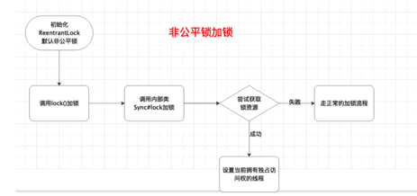
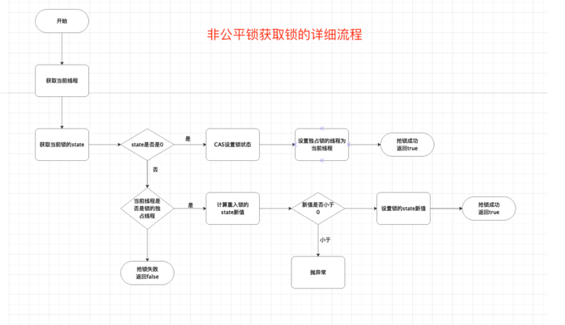
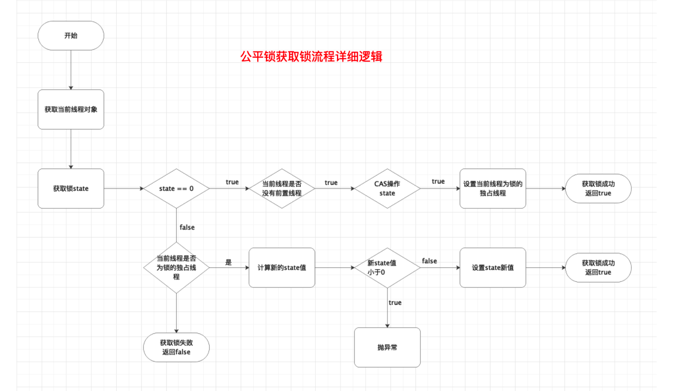
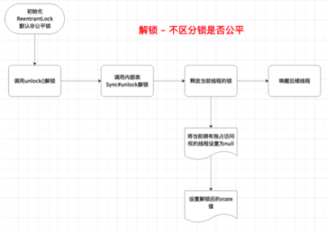
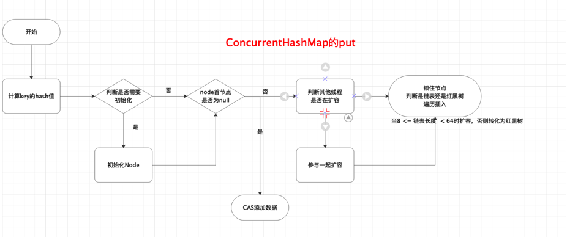
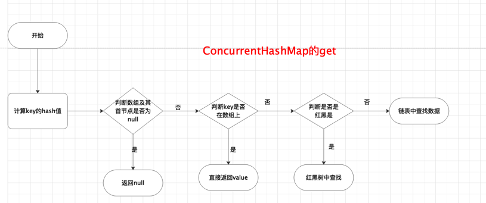
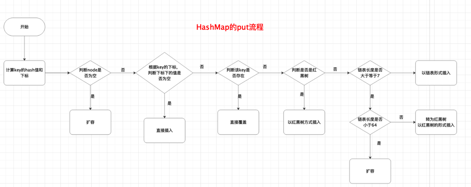
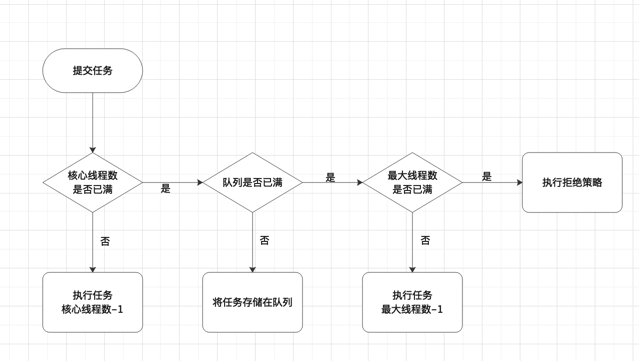
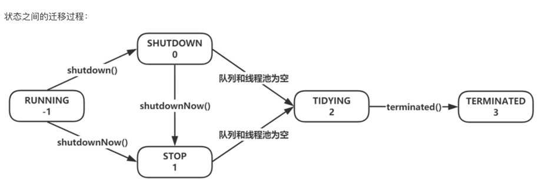

# 并发编程
## 并发编程基本概念
1. 并发编程三要素
    - 原子性：一个或多个操作要么全部执行成功，要么全部执行失败；
    - 有序性：程序的执行顺序按照代码的先后顺序执行。（处理器可能会对指令进行重排序）；
    - 可见性：当多个线程访问同一个变量时，如果其中一个线程对其进行了修改，其他线程能够立即获取到新值；
2. 线程的五大状态
    - 新建：用new操作符创建一个线程时；
    - 就绪：调用start方法。处于就绪状态的线程不一定就会马上执行run方法，还要等待CPU的调度；
    - 运行：CPU开始调度线程，并开始执行run方法；
    - 阻塞：线程在执行过程中由于一些原因进入阻塞状态。比如调用sleep方法，尝试去得到一个锁；
    - 死亡：run方法执行完，或者执行过程遇到了一个异常；
3. 悲观锁与乐观锁
    - 悲观锁：每次操作都会加锁，会造成线程阻塞；
    - 乐观锁：每次操作都不会加锁，直到提交的时候才判断是否冲突。冲突失败就重试，直到成功为止，不会造成线程阻塞；
4. 线程之间的协作：wait、notify、notifyAll
5. synchronized关键字
    - 修饰一个代码块：作用范围是整个代码块，作用对象是调用这个代码块的对像；
    - 修饰一个方法：作用范围是整个方法，作用对象是调用这个方法的对象；
    - 修饰一个静态方法：作用的范围是整个静态方法，作用的对象是这个类的对象；
    - 修饰一个类：作用范围是synchronized后大括号的范围，作用对象是这个类的对象；
6. 线程池 \
   如果我们使用线程的时候就去创建一个线程，虽然简单，但是存在很大的问题。如果并发的线程数量很多，并且每个线程都是执行一个时间很短的任务就结束了，
这样频繁创建线程就会大大降低系统的效率，因为频繁创建线程和销毁线程需要时间。线程池通过复用可以大大减少线程频繁创建与销毁带来的性能上的损耗。
7. 死锁出现的条件
    - 互斥条件：一个资源只能被一个进程使用；
    - 请求与保持条件：一个进程因请求资源而阻塞时，对已获取的资源保持不放；
    - 不可剥夺条件：进程使用的资源，在未使用完之前不可强行剥夺；
    - 循环等待条件：若干进程间互相持有彼此的资源，形成一种首尾相接循环等待的环。
8. 避免死锁的方式
    - 设置加锁顺序：按照相同的顺序加锁；
    - 设置加锁时限：超时放弃锁、超时重试获取锁；
    - 死锁检测：存储锁信息，加锁时先检查锁资源是否被占用。
9. 活锁 \
   如果系统中有两个任务，它们总是因对方的行为而改变自己的状态， 那么就出现了活锁。最终结果是它们陷入了状态变更的循环而无法继续向下执行。活锁有可能会自己打开。
   例如，有两个任务：任务1和任务2 ，它们都需要用到两个资源：资源1和资源2 。假设任务1对资源1加了一个锁，而任务2 对资源2 加了一个锁。当它们无法
访问所需的资源时，就会释放自己的资源并且重新开始循环。这种情况可以无限地持续下去，所以这两个任务都不会结束自己的执行过程。

## CAS
全称是Compare And Swap即比较并替换。该操作包含三个操作数：内存位置(V)、预期原值(A)、新值(B)。如果内存位置的值与预期原值相匹配，那么处理器就
会自动将该位置值更新为新值。否则处理器不做任何操作。
CAS存在三大问题：ABA问题，循环时间长开销大，只能保证一个共享变量的原子操作。
- ABA问题介绍
   线程1从内存X中取出A，同时线程2也从内存X中取出A，并且线程2进行了一些操作将内存中的X变成了B，然后线程2又将内存中的X数据变成了A。这时候线程1
进行CAS操作发现内存中仍然是A，然后线程1操作成功。这时虽然线程1CAS操作成功了，但是整个过程是有问题的。比如链表的头在变化了两次后恢复了原值，但这不能代表链表没有变化。
- ABA问题解决方案
    - 添加版本号
    - AtomicStampedReference。java并发包为解决这个问题，提供了一个带有标记的原子引用类`AtomicStampedReference`。他可以通过控制变量值
的版本来保证CAS的正确性。因此在使用CAS前要考虑清楚“ABA”问题是否会影响程序并发的正确性。如果需要解决ABA问题，改为传统的互斥同步可能会比原子类更有效。

## AQS
- 通过变量state来保存这个锁的状态，如果想获取这把锁的话先检查这把锁的状态。
- 如果是共享锁看下是否大于0，大于的话可以拿到锁，同时通过CAS将state值减1；
- 如果是排他锁的话看下是否等于0，如果不等于0的话看下当前线程是否是持有锁的线程，是当前线程的话可以重入，不是的话要去抢锁。
  抢锁分为公平和非公平的两种方式，非公平的话不用排队直接抢，抢到就执行，抢不到再排队；公平的话直接排队。

## Volatile
1. 内存可见性
    - 当一个线程对volatile修饰的变量进行写操作时，JMM会立即把该线程对应的本地内存中的共享变量刷新到主内存；
    - 当另一个线程对voatile修饰的变量进行读操作时，JMM会立即将当前线程对应的本地内存设置为无效，从主内存中读取共享变量的值。\
   **注：主内存对应于硬件的物理内存，工作内存对应于寄存器和高速缓存。**
2. JSR-133增强了volatile的内存语义：严格限制编译器和处理器对volatile变量和普通变量的重排序。JMM通过内存屏障限制处理器的重排序。
3. 内存屏障的作用
    -  阻止屏障两侧的指令重排序；
    -  强制把写缓冲区/高速缓冲中的脏数据等写回到主存，或者让缓存中相应的数据失效；
4. volatile的使用场景
    - 修饰标记变量
    - 单例中的双重检查锁模式
    ```java
    class Singleton {
     	private volatile static Singleton instance = null;
      
      public Singleton(){}
      
      public static Singleton getInstance
        //因为没有加锁，可以并发。
        // 由于instance使用volatile修饰，因此每次读取，都会从主内存读取。
     		if(instance != null){
          synchronized(Singleton.class) {
            if(instace == null){
              instance = new Siglenton();
            }
          }
        }
        return instance;
      }
      
    }
    ```

## ReentrantLock
### ReentrantLock的加锁和解锁的过程

1. 加锁
    - 通过ReentrantLock的`lock()`进行加锁操作；
    - 会调用到内部类Sync的`lock()`。由于`Sync#lock`是抽象方法，根据ReentrantLock初始化选择的公平锁和非公平锁，执行相关内部类的`lock()`。本质上都会执行AQS的`acquire()`；
    - AQS的`acquire()`会执行`tryAcquire()`，但是由于tryAcquire需要自定义同步器实现，因此执行了ReentrantLock中的`tryAcquire()`。由于ReentrantLock是通过公平锁和非公平锁内部类实现的`tryAcquire()`，因此会根据锁类型不同，去执行不同的tryAcquire;
    - tryAcquire是获取锁的逻辑，获取失败后会执行框架AQS的后续逻辑，根ReentrantLock自定义同步器无关。



2. 解锁
    - 通过ReentrantLock的解锁方法`unLock()`进行解锁操作；
    - `unLock()`会调用内部类Sync的`release()`，该方法继承自AQS；
    - `realease()`会调用`tryRelease()`，`tryRelease()`需要自定义同步器实现。`tryRelease()`只在ReentrantLock的内部类Sync中实现。因此可以看出释放锁的过程并不区分是否为公平锁；
    - 释放成功后所有操作由AQS框架完成，与自定义同步器无关。


## Synchronized
1. Synchronized的特点 \
   原子性、可见性、有序性、可重入性。与volatile最大的区别是volatile不具有原子性。
2. Synchronized的底层结构 \
   在JVM中，对象是分为3部分存在的：对象头、实例数据和对齐填充。Synchronized申请锁、上锁和释放锁都与对象头有关。对象头主要结构是Mark World和
   Class Metadata Address组成。Mark World存储对象的hashCode、锁信息和分代年龄或GC标志等信息。Class Metadata Address是类型指针指向对象
   的类元数据，JVM通过该指针确定该对象是哪个类的实例。锁的类型和状态都在对象头的Mark World中记录，在申请锁和锁升级等过程中JVM都需要读取对象的Mark World数据。 \
   Mark World：

    | 偏向锁标识为 | 锁标识位 | 锁状态   | 存储内容                     |
    | ------------ | -------- | -------- | ---------------------------- |
    | 0            | 01       | 未锁定   | hash code(31),年龄(4)        |
    | 1            | 01       | 偏向锁   | 线程ID(54),时间戳(2),年龄(4) |
    | 无           | 00       | 轻量级锁 | 栈中锁记录的指针(64)         |
    | 无           | 10       | 重量级锁 | monitor的指针(64)            |
    | 无           | 11       | GC标记   | 空，不需要记录信息           |
3. 锁膨胀 \
   锁有四种状态且会根据实际情况进行膨胀升级，其膨胀方向是：无锁 --> 偏向锁 --> 轻量级锁 --> 重量级锁；
4. 锁消除  \
   一种虚拟的锁优化机制，在JIT编译时，对运行上下文进行扫描，去除不可能存在竞争的锁。
       ```java
       //因为object锁是线程私有变量，不存在竞争关系。
       public void helloWorld1() {
           Object object = new Object();
           synchronized(object) {
               // 执行同步代码
               System.out.println("hello world");
           }
       }
    
       public void helloWorld2() {
           Object object = new Object();
           System.out.println("hello world");
       }
       ```
5. 锁粗化 \
   通过扩大锁的范围，避免反复加锁和释放锁

       ```java
       public void method3() {
           for (int i = 0; i < 10000; i++) {
               synchronized(Test.class) {
                   System.out.println("hello world");
               }
           }
       }
       //虚拟机会自动将锁粗化为下面的形式
       public void method4() {
           synchronized(Test.class) {
               for (int i = 0; i < 10000; i++) {
                   System.out.println("hello world");
               }
           }
       }
       ```
6. 自适应锁与自旋锁 \
   轻量级锁失败后，虚拟机为了避免线程真实的在操作系统层面挂起，还会进行一项自旋锁的优化手段。
    - 自旋锁 \
      许多情况下，共享数据锁定状态持续时间较短，切换线程不值得，通过让线程执行循环，等待锁的释放，不让出CPU。如果得到了锁，就顺利进入临界区。
      如果还不能得到锁，就会将线程在操作系统层面挂起。这就是自旋锁。
    - 自适应自旋锁 \
      针对自旋锁进行优化，它的自旋次数不再固定，其自旋的次数由前一次在同一个锁上的自旋时间及锁的拥有者状态来决定。
7. 锁升级的过程
    - 当没有被当锁的时候就是一个普通对象，是否为偏向锁为0，锁标志位为01；
    - 当对象被当作同步锁时，线程A抢到锁，是否为偏向锁为1，锁标志位仍然为01。此时锁升级为偏向锁；
    - 当线程A再来试图获取锁时，JVM发现同步锁对象的标志位为01，是否为偏向锁为1，也就是此时时偏向锁状态。Mark World中记录的ID就是线程A自己的ID，表示线程A已经获取到了这个偏向锁，可以执行同步锁的代码。这就是偏向锁的意义；
    - 当一个线程B尝试获取锁，JVM发现当前的锁处于偏向状态，并且Mark World中记录的线程ID不是B线程的ID。那么B线程会用CAS操作将线程ID改为自己的。这里有可能成功，有可能失败，因为A线程一般不会释放偏向锁。如果CAS操作失败，则执行下一条；
    - 偏向锁抢锁失败，说明当前锁存在一定的竞争，偏向锁就升级为轻量级锁，锁标志位改为00。JVM会在当前线程的线程栈中开辟一块单独的空间，里面保存指向对象锁Mark World的指针，同时在对象锁Mark World中保存指向这片空间的指针。上面的保存都是CAS操作，如果竞争成功，代表线程B抢到了锁，可以执行同步代码。如果抢锁失败，则继续执行下一条；
    - 轻量级锁抢锁失败，则JVM会使用自旋锁，自旋锁并非是一个锁，而是一个循环操作，不断地尝试获取锁。从JDK1.7开始，自旋默认开启，自旋次数由JVM决定。如果抢锁成功，则执行自旋代码，否则执行下一条；
    - 如果自旋锁重试之后仍未抢到锁，同步锁会升级至重量级锁，锁标志位改为10。在这个状态下，未抢到锁的线程都会被阻塞，由Monitor管理，并会有线程的park和unpack。因为这个存在用户态和内核态的转换，比较消耗资源，因此称之为重量级锁。
8. ReentrantLock和Synchronized的区别 \
   ReentrantLock和Sychronized都是java提供的可重入锁，二者的主要区别主要有以下几个方面：
    - 实现原理不同。Synchronized是JVM层面通过监视器实现的，而ReentrantLock是基于AQS实现的；
    - 使用方法不同。Sychronized 可以用来修饰不同方法、静态方法和代码块，而ReentrantLock只能用于码块；
    - 获取锁和释放锁的方式不同：Synchronized可以自动加锁和释放锁，而ReentrantLock需要手动加锁和释放锁；
    - 锁类型不同：Sychronized是非公平锁，而ReentrantLock可以是公平锁也可以是非公平锁，默认为非公平锁；
    - 响应中断不同：ReentrantLock可以响应中断，解决死锁问题，而Synchronized不能响应式中断。 

## ConcurrentHashMap
1. 实现原理
    1. 1.7实现原理 \
       jdk1.7中ConcurrentHashMap把哈希桶数组分成切分成16个小数组Segment，每个小数组由n个hashEntry组成。首先将数组分成一段段的存储，然后给每一段配一把Segment锁。当一个线程占用锁访问其中一段数据时，其他段的数据也能被其他线程访问，实现并发访问。
    2. 1.8实现原理
       jdk1.8中ConcurrentHashMap选择了与HashMap相同的实现方式：数组+链表+红黑树结构。在锁实现上采用CAS + Synchronized实现更加细粒度的锁。将锁的级别控制在了更细粒度的hash桶数组元素级别，只要锁住这个链表头节点或红黑树根节点，就不会影响其他哈希桶数组元素的读写，大大提高了并发度。
2. ConcurrentHashMap



3. ConcurrentHashMap的get方法是否要加锁 \
   `get()`不需要加锁。因为Node元素的value和指针Next都是用volatile修饰的，在多线程环境下线程A修改节点的value或者新增节点的时候是对线程B可见的。这也是它比其他并发集合效率高的原因。比如Hashtable、Collections.synchronizedMap() 。
4. ConcurrentHashMap不支持key和value为null的原因 \
   因为ConcurrentHashMap是工作与多线程的，如果`ConcurrentHashMap.get(key)`返回null，就无法判断值是null还是没有找到该key；而单线程的HashMap可以用`containsKey(key)`判断是否包含了这个null值。
5. ConcurrenthashMap是强一致性还是弱一致性 \
   HashMap是强一致性不同，ConcurrenthashMap是弱一致性；\
   ConcurrentHashMap在遍历过程中，内部元素可能发生变化。如果变化发生在已遍历过的部分，迭代器就不会反应出来；如果变化发生在未遍历过的部分，迭代器就会发现并反映出来，。这就是弱一致性。
6. jdk1.7和jdk1.8中ConcurrentHashMap的区别
    - 数据结构：1.7是segment分段锁的数据结构；1.8是数组+链表+红黑树的数据结构；
    - 线程安全：1.7是segment分段锁机制；1.8是CAS+Synchronized机制；
    - 加锁粒度：1.7是对Segment加锁；1.8是对数组元素加锁（Node）；
    - 查询时间复杂度：1.7是O(n)；1.8是O(log~n~)

## 线程池
1. 线程池执行流程

2. 线程池的状态
    - RUNNING
    - SHUTDOWN
    - STOP
    - TIDYING
    - TERMINATED
3. 线程池优雅关闭 \
   线程池有两个关闭方法，`shutdown()`和`shutdownNow()`，`shutdown()`切换到SHUTDOWN状态，`shutdownNow()`切换到STOP状态，当队列和线程池都为空的时候切换到TIDYING状态，最后执行`terminated()`进入到TERMINATED状态。\
   线程池的时候，调用`shutdown()`和`shutdownNow()`线程池不会立即关闭。如果需要在线程池关闭之后做资源回收处理等，可以调用`awaitTermination()`来等待线程池关闭；`awaitTermination()`会不断循环判断线程池是否达到了最终状态TERMAINATED。如果是就返回，如果不是就通过 termination 条件变量阻塞一段时间，之后继续判断。\
   shutdown()不会清空任务队列，会等所有任务执行完成，只会中断空闲的线程；shutdownNow()会中断所有线程，清空任务队列。
    ```java
      // executor.shutdownNow();
      executor.shutdown(); // 关闭线程池
      // 如果希望在线程池彻底关闭之后进行其他操作比如资源的回收等，可以：
      try {
          boolean flag = true;
          do {
              flag = !executor.awaitTermination(500, TimeUnit.MILLISECONDS);
          } while (flag);
      } catch (InterruptedException e) {
          // 异常处理
      }
    ```

4. 线程池的拒绝策略
    - CallerRunsPolicy：调用者直接在自己线程里执行，线程池不处理；
    - AbortPolicy：线程池抛异常；
    - DiscardPolicy：线程池直接丢掉任务；
    - DiscardOldestPolicy：删除队列中最早的任务，将当前任务入列；
5. corePoolSize和maxPoolSize一般设置为多大
    - CPU密集型 \
      CPU密集型就是指该任务需要大量计算而没有阻塞，CPU一直全速运行；CPU密集型只有在真正的多核CPU上才能得到加速（通过多线程）。CPU密集型任务配置尽可能少的线程数。 \
      **CPU密集型线程数配置公式：CPU核数 + 1**
    - I/O密集型 \
      IO密集型指该任务需要大量的IO，即大量的阻塞。在单线程上运行IO密集型的任务会导致大量的CPU运算能力浪费在等待上。所以IO密集型任务中使用多线程可以大大加速程序运行。即使在单核CPU上，这种加速主要利用了被浪费掉的阻塞时间。 \
      由于IO密集型任务的线程并不是一直在执行任务，大部分线程都在阻塞，所以应配置尽可能多的线程
        - 配置方式一；
          **IO密集型线程数配置公式一：CPU核数 * 2**
        - 配置方式二
          **IO密集型线程数配置公式二：CPU核数 /  (1 - 阻塞系数) **（阻塞系数在0.8到0.9之间）\
          比如：8核 / (1 - 0.9) = 80个线程 \
      线程数量只增加不减少也不行。当负载降低时，可减少线程数量，如果一个线程空闲时间达到 keepAliveTime，该线程就退出。默认情况下线程池最少会保持 corePoolSize 个线程。\
      maxPoolSize 最大线程数在生产环境上<font color=red>往往设置成corePoolSize一样，减少在处理过程中创建线程的开销</font>。

## ThreadLocal
1. 什么是ThreadLocal \
   ThreadLocal使用场合主要解决多线程中数据数据因并发产生不一致问题。ThreadLocal为每个线程的中并发访问的数据提供一个副本，通过访问副本来运行业务，这样的结果是耗费了内存，大大减少了线程同步所带来性能消耗，也减少了线程并发控制的复杂度。
2. ThreadLocal如何解决hash冲突 \
   ThreadLocal中解决hash冲突的方式是采用线性探测法。即根据初始key的hashcode值确定元素在table中的位置，如果发现这个位置上已经被其他key占用，则利用固定的算法寻找一定步长的下一个位置。依次判断，直至找到能够存放的位置。
3. ThreadLocal的内存泄漏 \
   ThreadLocal在ThreadLocalMap中以弱引用被entry中的key引用。如果ThreadLocal没有外部强引用来引用他，那么ThrealLocal会在下次JVM垃圾收集时被回收。这时Entry中的key已经被回收，但是value又是一个强引用不会被垃圾回收器回收，这样ThreadLocal的线程如果一直持续运行，没有设置remove方法释放掉这个Entry的话，那么这个线程的ThreadLocal中的Entry就会一直存在，value就一直得不到回收，这样就会发生内存泄漏。所以一定要手动设置remove()。
4. 为什么ThreadLocalMap 中key是弱引用 \
    - key是强引用：如果使用ThreadLocal的对象需要被回收，但是Thread持有ThreadLocalMap对象和ThreadLocal的强引用。如果没有手动删除，ThreadLocal不会被回收，则会导致内存泄漏。
    - key使用弱引用：引用的ThreadLocal的对象需要被回收，由于ThreadLocalMap持有ThreadLocal的弱引用，即使没有被手动删除，ThreadLocal也会被回收。value在下一次ThreadLocalMap调用set()、get()、remove()的时候会被清除。 \
   由于ThreadLocalMap的生命周期和Thread一样长，如果没有手动删除对应key，就会导致内存泄漏。但是使用弱引用可以多一层保护，弱引用的ThreadLocal不会内存泄漏，对应的value在下一次ThreadLocalMap调用set()、get()、remove()时被清除。

## 经典并发问题
1. 为什么Java要把`notify()`和`wait()`方法放到Object里面？为什么一定要和Synchronized一起使用？\
   两个线程之间要通信，对于同一个对象来说，一个线程调用对象的wait()，另一个线程调用该对象的notify()。这样的话该对象本身就需要同步。所以要通过
Synchronized关键字给对象加锁。Synchronized关键字可以加载任何对象的实例方法上面，任何对象都可能成为锁。因此只能放在Object对象里。
2. 为什么wait的时候必须先释放锁？\
   当线程进入Synchronized锁的代码中之后，此时调用wait方法进入阻塞状态一直不能退出被Synchronized锁的代码。如果不先释放锁，那么其他的线程永
远无法拿到锁，无法进入被Synchronized锁的代码，无法调用notify()，产生死锁。